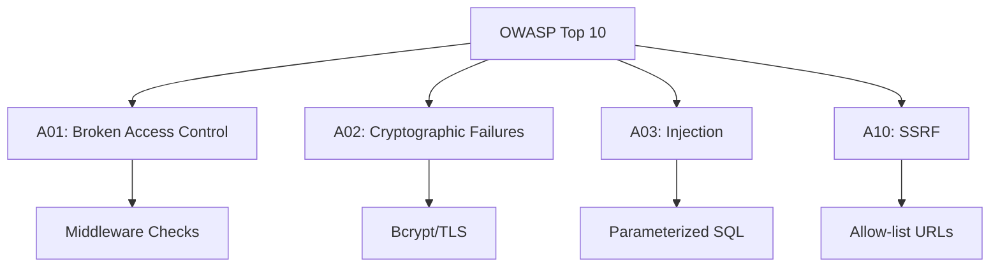

# SEC.10 OWASP Top 10 for Go

## Mission

Master the industry-standard "OWASP Top 10" web security risks through the lens of a Go developer. Learn how to map generic security concepts (like Injection, Broken Access Control, and SSRF) to concrete Go implementation decisions and code review checklists.

## Prerequisites

- SEC.1 through SEC.9

## Mental Model

Think of the OWASP Top 10 as **The Building Code for Web Applications**.

1. **The Standard**: Just as a house must have fire alarms and emergency exits, a web app must have defenses against the most common ways it can be "burned down."
2. **The Checklist**: You don't have to guess what's dangerous. The security community has already found the 10 most likely ways your app will be attacked.
3. **The Focus**: Security is infinite, but your time is not. The OWASP list helps you focus your energy on the **High Probability, High Impact** risks first.

## Visual Model



## Machine View

- **A01: Broken Access Control**: In Go, this often means forgetting to check a UserID from the context before allowing a `DELETE` request.
- **A03: Injection**: Covers SQL Injection (SEC.2) and Command Injection (unsafe use of `os/exec`).
- **A05: Security Misconfiguration**: Using default passwords, leaving debug mode on in production, or improper CORS settings.
- **A09: Security Logging and Monitoring Failures**: Not logging auth failures or not having alerts when 401/403 errors spike.

## Run Instructions

```bash
# Run the demo to see a checklist of Go-specific OWASP defenses
go run ./09-architecture/04-security/10-owasp-top-10-for-go
```

## Code Walkthrough

### Broken Access Control
Shows a vulnerable "Edit Profile" endpoint that doesn't check if the `id` in the URL matches the `id` of the logged-in user. We demonstrate how to fix it using a context-based check.

### Server-Side Request Forgery (SSRF)
Demonstrates a "URL Preview" feature. An attacker can use it to scan your internal network (e.g., `http://localhost:8080/admin`). We show how to use an allow-list of domains to prevent this.

## Try It

1. Look at `main.go`. Can you find the "Insecure" endpoint and exploit it to read another user's data?
2. Apply the fix. Verify that the attack no longer works.
3. Discuss: Which of the Top 10 risks is the most common in modern microservices?

## In Production
**Security is a process, not a product.** The OWASP Top 10 changes every few years as the threat landscape evolves. Make the OWASP checklist a part of your **Definition of Done** for every new feature. Use static analysis tools like `gosec` to automatically scan your Go code for these common vulnerabilities.

## Thinking Questions
1. Why is "Broken Access Control" now the #1 risk (overtaking Injection)?
2. How does "Insecure Design" (A04) differ from a simple coding bug?
3. What is the danger of "Vulnerable and Outdated Components" (A06) in a Go project?

## Next Step

Next: `SEC.11` -> `09-architecture/04-security/11-secure-api-exercise`

Open `09-architecture/04-security/11-secure-api-exercise/README.md` to continue.
