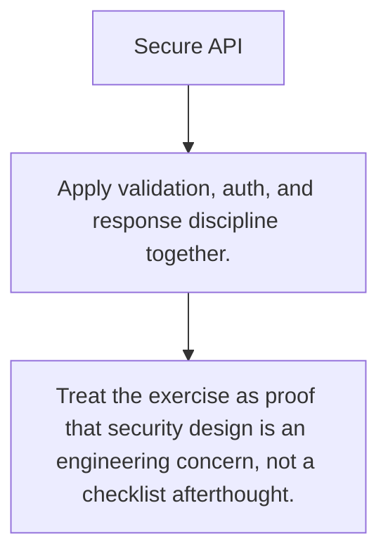

# SEC.11 Secure API

## Mission

Build a small API surface that applies validation, auth boundaries, secret-safe behavior, and rate limiting ideas together.

## Prerequisites

- SEC.1
- SEC.2
- SEC.3
- SEC.4
- SEC.5
- SEC.6
- SEC.7
- SEC.8
- SEC.9
- SEC.10

## Mental Model

Security is rarely one big feature. It is the sum of many small boundary decisions made consistently.

## Visual Model



## Machine View

The exercise matters because it forces transport, validation, credential, and failure rules into one concrete shape.

## Run Instructions

```bash
go run ./09-architecture/04-security/11-secure-api-exercise
```

## Solution Walkthrough

- Apply validation, auth, and response discipline together.
- Protect the boundary before business logic runs.
- Treat the exercise as proof that security design is an engineering concern, not a checklist afterthought.

## Verification Surface

- Use `go run ./09-architecture/04-security/11-secure-api-exercise`.
- Starter path: `09-architecture/04-security/11-secure-api-exercise/_starter`.

## Try It

1. Change one of the example inputs and rerun the lesson.
2. Explain which boundary the lesson is trying to make explicit.
3. Describe how you would apply SEC.11 in a small service or tool.

## ⚠️ In Production

Secure systems are built from layered controls that keep working even when one layer is stressed or misused.

## 🤔 Thinking Questions

1. What problem does this topic solve?
2. What breaks if this boundary is handled implicitly instead of explicitly?
3. Where would you expect to use this topic in production Go code?

## Next Step

Use this lesson as a reference surface before moving to the next track in the section.
