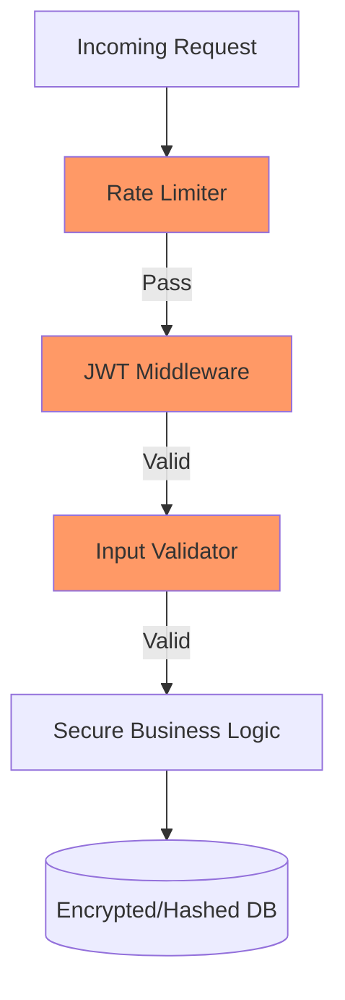

# SEC.11 Secure API Exercise

## Mission

Put your security knowledge into practice. Take a "Vulnerable API" and transform it into a hardened, production-ready system. You will implement layered defenses including **Input Validation**, **Bcrypt Password Hashing**, **JWT Authentication**, and **Rate Limiting**.

## Prerequisites

- Complete SEC.1 through SEC.10.

## Mental Model

Think of this exercise as **Hardening a Fortress**.

1. **The Moat (Rate Limiting)**: Stop the swarm of attackers from overwhelming the gate.
2. **The Drawbridge (Authentication)**: Only let in people with a valid, signed pass (JWT).
3. **The Guard (Validation)**: Check that every person is carrying exactly what they claim to be carrying.
4. **The Inner Vault (Password Hashing)**: Even if an attacker gets inside, make sure the treasures (passwords) are unreadable confetti.

## Visual Model



## Machine View

- **Defense in Depth**: We don't rely on one single security feature. If the JWT is stolen, the rate limiter slows down the attack. If the rate limiter is bypassed, the input validator stops the SQLi.
- **Fail-safe Defaults**: The API should reject everything by default and only allow specific, validated actions.

## Run Instructions

```bash
# Run the starter code (It's full of bugs and vulnerabilities!)
go run ./09-architecture/04-security/11-secure-api-exercise/_starter

# Run the tests to verify your hardened API
go test ./09-architecture/04-security/11-secure-api-exercise
```

## Solution Walkthrough

1. **Analyze**: Open `_starter/main.go`. Identify at least 5 major security vulnerabilities (Hint: check SQL, passwords, and auth).
2. **Harden Passwords**: Replace the plaintext password storage with Bcrypt hashing.
3. **Secure the Database**: Replace the vulnerable SQL strings with parameterized queries.
4. **Implement JWT**: Add a middleware that requires a valid JWT for the `POST` and `DELETE` endpoints.
5. **Add Rate Limiting**: Limit the `Login` endpoint to 5 attempts per minute per IP.
6. **Validate Input**: Ensure all incoming data matches the expected format (e.g., email validation).
7. **Verify**: Ensure all tests pass.

## Try It

1. Use `curl` to try and bypass your new defenses. Can you still log in with a fake password?
2. Try to "Brute Force" the login. Does the rate limiter kick in?
3. (Challenge) Implement "Role-Based Access Control" (RBAC): only users with the `admin: true` claim in their JWT can delete users.

## Verification Surface

- Use `go test ./09-architecture/04-security/11-secure-api-exercise/...`.
- Starter path: `09-architecture/04-security/11-secure-api-exercise/_starter`.


## In Production
**Security is never finished.** New vulnerabilities are discovered every day. In production, you should combine these coding practices with infrastructure-level security (WAFs, VPCs, IAM roles) and regular security audits. The goal is to make attacking your system so expensive and difficult that the attacker gives up and moves on to an easier target.

## Thinking Questions
1. Which layer of defense was the easiest to implement? Which was the hardest?
2. If you had to remove one layer of defense to save performance, which would it be and why?
3. How does "Observability" (logs/metrics) help you identify an ongoing attack?

## Next Step

Next: `SL.1` -> `10-production/01-structured-logging/1-slog-basics`

Open `10-production/01-structured-logging/1-slog-basics/README.md` to continue.
