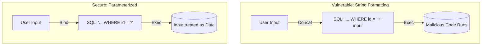

# SEC.2 SQL Injection Prevention

## Mission

Master the defense against SQL Injection (SQLi), one of the oldest and most dangerous web vulnerabilities. Learn why you should **Never Concatenate SQL Strings** and how to use **Parameterized Queries** in Go to ensure that user input is always treated as data, never as executable code.

## Prerequisites

- SEC.1 Input Validation Patterns
- Section 05: Data Persistence (Basics of `database/sql`)

## Mental Model

Think of SQL Injection as **A Malicious Form Entry**.

1. **The Scenario**: A form asks for your "First Name."
2. **The Honest User**: Enters "Alice." The query becomes: `SELECT * FROM users WHERE name = 'Alice'`.
3. **The Malicious User**: Enters `Alice'; DROP TABLE users; --`.
4. **The Disaster (Concatenation)**: If you use string formatting (`fmt.Sprintf`), the query becomes: `SELECT * FROM users WHERE name = 'Alice'; DROP TABLE users; --'`. The database executes *both* commands.
5. **The Defense (Parameterization)**: If you use parameters (`?` or `$1`), the database treats the entire string `Alice'; DROP TABLE users; --` as a single, harmless name. It searches for a user with that literal name and finds nothing.

## Visual Model



## Machine View

- **Placeholders**: Go's `database/sql` package uses placeholders like `?` (MySQL/SQLite) or `$1, $2` (PostgreSQL).
- **Prepared Statements**: Under the hood, the driver sends the query structure to the database first, then sends the data separately. The database "pre-compiles" the query, so it knows exactly where the data ends and the commands begin.
- **ORM Safety**: ORMs like GORM are generally safe, but only if you use their built-in query builders. Using `db.Raw("... " + input)` is just as dangerous as plain SQL.

## Run Instructions

```bash
# Run the demo to see how SQLi is attempted and blocked
go run ./09-architecture/04-security/2-sql-injection-prevention
```

## Code Walkthrough

### The Vulnerable Query
Demonstrates a "Login" bypass where an attacker enters `' OR '1'='1` as a password to log in as the first user in the database.

### The Secure Query
Shows the exact same logic using `db.QueryRow("SELECT ... WHERE pass = ?", input)`. The attack fails because the database looks for the literal string `' OR '1'='1`.

## Try It

1. Look at `main.go`. Try to use the `' OR '1'='1` trick to bypass the login in the "Vulnerable" example.
2. Fix the vulnerable query using a parameter placeholder.
3. Discuss: Is it safe to use a variable for a Table Name (e.g., `SELECT * FROM ` + tableName)? Why/Why not?

## In Production
**No Exceptions.** Even for internal tools or "safe" inputs, always use parameterized queries. SQLi can lead to total data loss, identity theft, and full server compromise. If you need dynamic queries (e.g., optional filters), use a query builder library rather than building strings manually.

## Thinking Questions
1. Why can't the database "detect" an injection attack automatically?
2. What is a "Blind SQL Injection"?
3. How does input validation (SEC.1) provide a "defense-in-depth" layer against SQLi?

## Next Step

Protecting the database is Step 1. Protecting the user's browser is Step 2. Learn how to prevent malicious scripts from running in your UI. Continue to [SEC.3 XSS and CSRF](../3-xss-and-csrf).
