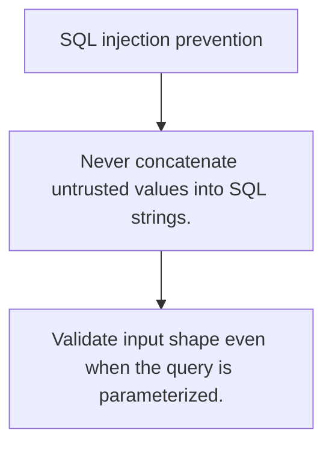

# SEC.2 SQL injection prevention

## Mission

Learn why parameterized queries are the baseline defense against SQL injection in Go.

## Prerequisites

- SEC.1

## Mental Model

SQL injection happens when untrusted input is treated as part of the query syntax instead of as data.

## Visual Model



## Machine View

Prepared statements and query parameters keep structure and untrusted values separate at the driver boundary.

## Run Instructions

```bash
go run ./09-architecture/04-security/2-sql-injection-prevention
```

## Code Walkthrough

### Never concatenate untrusted values into SQL strings.

Never concatenate untrusted values into SQL strings.

### Use parameter placeholders and argument binding.

Use parameter placeholders and argument binding.

### Validate input shape even when the query is parameteri

Validate input shape even when the query is parameterized.

## Try It

1. Change one of the example inputs and rerun the lesson.
2. Explain which boundary the lesson is trying to make explicit.
3. Describe how you would apply SEC.2 in a small service or tool.

## ⚠️ In Production

String-building SQL with user input is a security bug even when it looks harmless in tests.

## 🤔 Thinking Questions

1. What problem does this topic solve?
2. What breaks if this boundary is handled implicitly instead of explicitly?
3. Where would you expect to use this topic in production Go code?

## Next Step

Continue to `SEC.3`.
