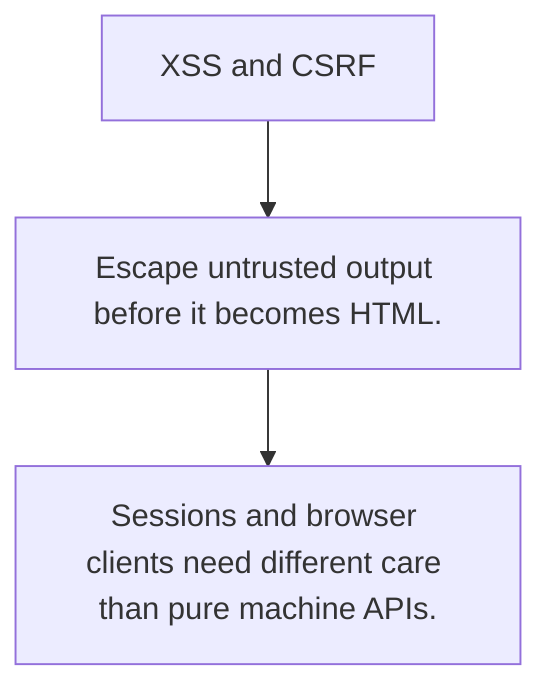

# SEC.3 XSS and CSRF

## Mission

Learn the difference between output-encoding bugs and cross-site request trust bugs in web systems.

## Prerequisites

- SEC.2

## Mental Model

XSS is an output encoding problem. CSRF is a trust and request-origin problem.

## Visual Model



## Machine View

Browsers automatically carry cookies and render HTML, which makes them powerful but risky clients.

## Run Instructions

```bash
go run ./09-architecture/04-security/3-xss-and-csrf
```

## Code Walkthrough

### Escape untrusted output before it becomes HTML.

Escape untrusted output before it becomes HTML.

### CSRF defenses prove the request came from the expected

CSRF defenses prove the request came from the expected origin or flow.

### Sessions and browser clients need different care than 

Sessions and browser clients need different care than pure machine APIs.

## Try It

1. Change one of the example inputs and rerun the lesson.
2. Explain which boundary the lesson is trying to make explicit.
3. Describe how you would apply SEC.3 in a small service or tool.

## ⚠️ In Production

Security bugs at the browser boundary depend on precise rules about output escaping, cookie scope, and request intent.

## 🤔 Thinking Questions

1. What problem does this topic solve?
2. What breaks if this boundary is handled implicitly instead of explicitly?
3. Where would you expect to use this topic in production Go code?

## Next Step

Continue to `SEC.4`.
