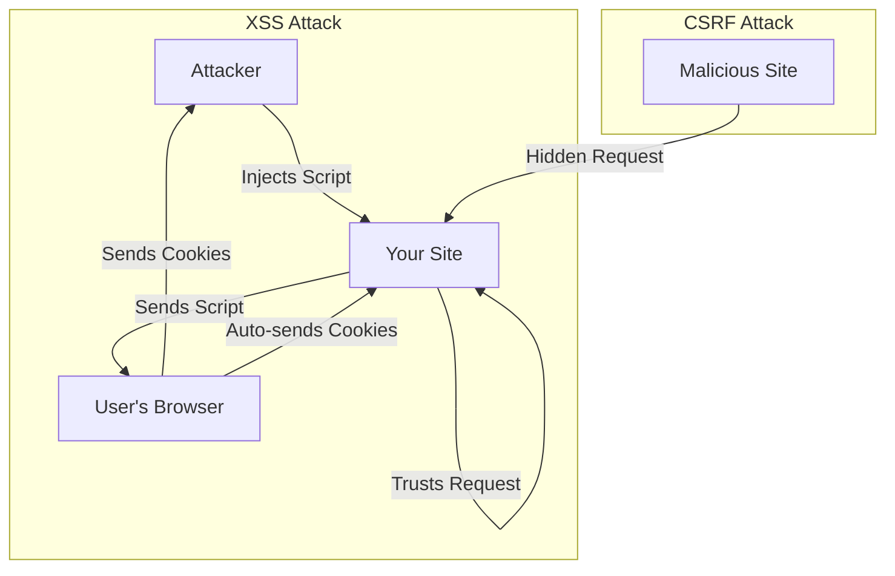

# SEC.3 XSS and CSRF Prevention

## Mission

Master the defense against the two most common browser-based attacks: **Cross-Site Scripting (XSS)** and **Cross-Site Request Forgery (CSRF)**. Learn how to use **Contextual Escaping** and **CSRF Tokens** to protect your users and your application's integrity.

## Prerequisites

- SEC.1 Input Validation Patterns
- Section 06: Web Servers (Basics of `html/template`)

## Mental Model

Think of these attacks as **Two Different Ways to Impersonate a User**.

1. **XSS (The Malicious script)**: An attacker injects a script into your site (e.g., in a comment). When other users view the comment, the script runs in *their* browser, steals their cookies, and sends them to the attacker.
   - *Defense*: **Always escape output.** Use Go's `html/template` which does this automatically.
2. **CSRF (The Malicious link)**: An attacker creates a link on *their* site: `https://your-bank.com/transfer?to=attacker&amount=1000`. If you are logged into your bank and click that link, your browser automatically sends your session cookies, and the bank thinks *you* made the request.
   - *Defense*: **Use a secret token.** Every sensitive form must include a hidden, random token that the attacker can't guess.

## Visual Model



## Machine View

- **Contextual Escaping**: Go's `html/template` knows if a variable is inside a `<div>`, an `href`, or a `<script>` tag and applies the correct escaping rules for that context.
- **SameSite Cookie Attribute**: A modern browser defense that prevents cookies from being sent on cross-site requests. Use `SameSite=Lax` or `Strict`.
- **CSRF Tokens**: A unique string generated for each session and required for every state-changing request (POST, PUT, DELETE).

## Run Instructions

```bash
# Run the demo to see how XSS and CSRF are attempted
go run ./09-architecture/04-security/3-xss-and-csrf
```

## Code Walkthrough

### XSS Vulnerability
Shows a page using `text/template` (which doesn't escape) vs `html/template`. You will see how an input like `<script>alert(1)</script>` is either executed or safely displayed as text.

### CSRF Defense
Demonstrates a form with and without a hidden `_csrf` token. You will see how the server rejects requests that don't include a valid token.

## Try It

1. Look at `main.go`. Try to "steal a cookie" in the XSS example by injecting a script that logs `document.cookie`.
2. Add a CSRF check to a "Delete User" endpoint.
3. Discuss: If your API is only used by mobile apps (no cookies, only headers), do you still need CSRF protection?

## In Production
**Use `html/template` for all HTML rendering.** Never build HTML by concatenating strings. For CSRF, use a middleware like `nosurf` or the built-in CSRF protection in frameworks like `Echo` or `Gin`. Set your cookies to `HttpOnly` and `Secure` to provide additional layers of defense.

## Thinking Questions
1. What is the difference between "Stored XSS" and "Reflected XSS"?
2. Why doesn't the `SameSite` cookie attribute completely replace the need for CSRF tokens?
3. How does Content Security Policy (CSP) help defend against XSS?

## Next Step

Protecting the browser is essential, but you also need to know *who* is making the request. Learn the basics of identity. Continue to [SEC.4 Authentication basics](../4-authentication-basics).
