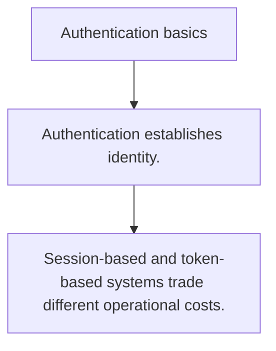

# SEC.4 Authentication basics

## Mission

Learn the core differences between proving identity with sessions, tokens, and surrounding account rules.

## Prerequisites

- SEC.3

## Mental Model

Authentication answers who the caller is; authorization answers what that caller may do next.

## Visual Model



## Machine View

Credential checks, session material, and request identity propagation all live at different layers of the request lifecycle.

## Run Instructions

```bash
go run ./09-architecture/04-security/4-authentication-basics
```

## Code Walkthrough

### Authentication establishes identity.

Authentication establishes identity.

### Authorization should use that identity explicitly.

Authorization should use that identity explicitly.

### Session-based and token-based systems trade different 

Session-based and token-based systems trade different operational costs.

## Try It

1. Change one of the example inputs and rerun the lesson.
2. Explain which boundary the lesson is trying to make explicit.
3. Describe how you would apply SEC.4 in a small service or tool.

## ⚠️ In Production

Auth systems fail when identity, session storage, and permission checks blur together without clear ownership.

## 🤔 Thinking Questions

1. What problem does this topic solve?
2. What breaks if this boundary is handled implicitly instead of explicitly?
3. Where would you expect to use this topic in production Go code?

## Next Step

Continue to `SEC.5`.
