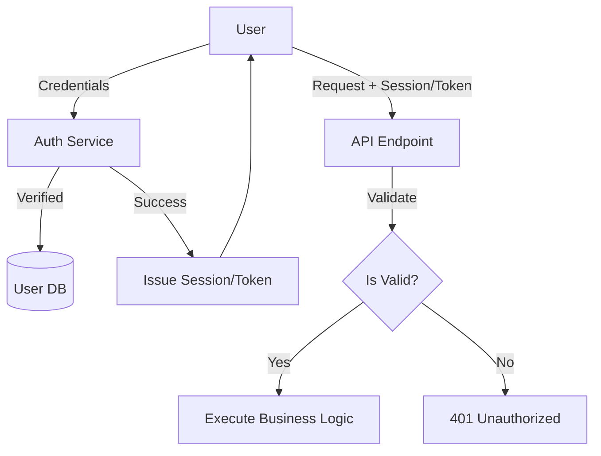

# SEC.4 Authentication Basics

## Mission

Master the fundamentals of Identity. Learn the difference between **Authentication** (Who are you?) and **Authorization** (What can you do?), and understand the trade-offs between **Session-based** and **Token-based** identity systems in Go.

## Prerequisites

- SEC.3 XSS and CSRF Prevention

## Mental Model

Think of Authentication as **Entering a Private Club**.

1. **The ID Check (Authentication)**: You show your ID to the bouncer. They verify that you are who you say you are.
2. **The Wristband (Session/Token)**: Once verified, the bouncer gives you a wristband. You don't have to show your ID every time you buy a drink; you just show the wristband.
3. **The VIP Area (Authorization)**: Just because you are in the club doesn't mean you can go into the VIP lounge. The staff checks if your wristband is the "VIP" color.

## Visual Model



## Machine View

- **Authentication**: Usually involves checking a Username/Password or a third-party token (OIDC/OAuth2).
- **Sessions**: The server stores a random "Session ID" in a database (or Redis) and sends it to the browser in a cookie. The server must look up the ID on every request.
- **Tokens (JWT)**: The server sends a signed "JSON Web Token" to the client. The client sends it back in a header. The server can verify the token *without* a database lookup.

## Run Instructions

```bash
# Run the demo to see basic authentication flows
go run ./09-architecture/04-security/4-authentication-basics
```

## Code Walkthrough

### The Simple Auth Flow
Demonstrates a hard-coded username/password check (simulating a database lookup) and the creation of a simple "Session" cookie.

### Authentication Middleware
Shows how to use Go's `http.Handler` middleware to intercept requests, check for a valid session, and inject the "User ID" into the `context.Context` for use by the business logic.

## Try It

1. Look at `main.go`. Try to access a "Protected" endpoint without logging in.
2. Modify the middleware to check for a specific header instead of a cookie.
3. Discuss: Why should you store the UserID in the `context.Context` instead of a global variable?

## In Production
**Never store passwords in plain text.** (We cover hashing in SEC.6). Use HTTPS for everything to prevent "Man-in-the-Middle" attacks from stealing your session cookies. For complex apps, prefer established identity providers (Auth0, Okta, Firebase Auth) rather than building your own authentication system from scratch.

## Thinking Questions
1. What is the difference between `401 Unauthorized` and `403 Forbidden`?
2. Why are "Stateless Tokens" (like JWT) popular for microservices?
3. How do you "Log out" a user in a token-based system vs. a session-based system?

## Next Step

Next: `SEC.5` -> `09-architecture/04-security/5-jwt-implementation-and-risks`

Open `09-architecture/04-security/5-jwt-implementation-and-risks/README.md` to continue.
