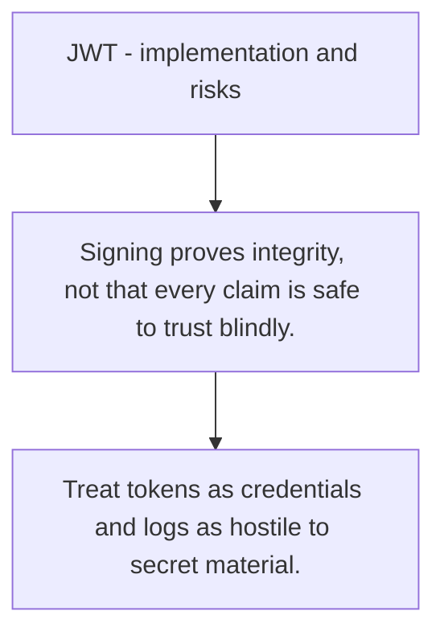

# SEC.5 JWT - implementation and risks

## Mission

Learn what a JWT contains, how signing works, and why tokens still create real operational risk when used carelessly.

## Prerequisites

- SEC.4

## Mental Model

A JWT is a signed claim set, not a trust system by itself.

## Visual Model



## Machine View

JWTs carry claims and signatures in one portable token, so correctness depends on key handling, expiry, and claim validation.

## Run Instructions

```bash
go run ./09-architecture/04-security/5-jwt-implementation-and-risks
```

## Code Walkthrough

### Signing proves integrity, not that every claim is safe

Signing proves integrity, not that every claim is safe to trust blindly.

### Validate issuer, audience, expiry, and algorithm polic

Validate issuer, audience, expiry, and algorithm policy.

### Treat tokens as credentials and logs as hostile to sec

Treat tokens as credentials and logs as hostile to secret material.

## Try It

1. Change one of the example inputs and rerun the lesson.
2. Explain which boundary the lesson is trying to make explicit.
3. Describe how you would apply SEC.5 in a small service or tool.

## ⚠️ In Production

JWT mistakes are rarely library mistakes. They are usually trust-boundary mistakes like weak key policy, bad expiry handling, or missing audience checks.

## 🤔 Thinking Questions

1. What problem does this topic solve?
2. What breaks if this boundary is handled implicitly instead of explicitly?
3. Where would you expect to use this topic in production Go code?

## Next Step

Continue to `SEC.6`.
