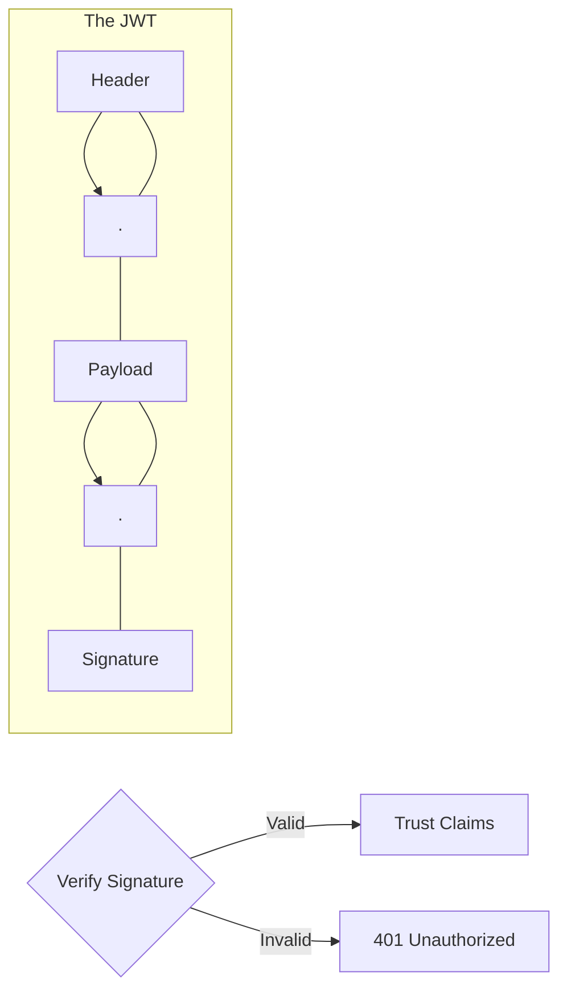

# SEC.5 JWT (JSON Web Tokens) Implementation and Risks

## Mission

Master the use of JSON Web Tokens (JWT) for stateless authentication. Learn how to securely **Sign**, **Verify**, and **Parse** tokens in Go, and understand the critical security risks (like "None" algorithm attacks and key management) that can compromise your entire system.

## Prerequisites

- SEC.4 Authentication Basics

## Mental Model

Think of a JWT as **A Notarized Document**.

1. **The Header (The Envelope)**: Tells the world what kind of document it is and what pen (Algorithm) was used to sign it.
2. **The Payload (The Claims)**: The actual information: "The bearer is User #123 and they are an Admin. This document expires in 1 hour."
3. **The Signature (The Notary Stamp)**: A cryptographic hash of the Header and Payload, created using a secret key.
4. **The Verification**: Anyone with the public key (or secret key) can check the stamp. If a single character in the Payload was changed, the stamp will no longer match.

## Visual Model



## Machine View

- **Base64URL Encoding**: JWTs are NOT encrypted. They are just Base64URL encoded. Anyone can decode the token and read the claims. **Never put sensitive data (like passwords) in a JWT payload.**
- **Signing Algorithms**: Use `HS256` (Symmetric - Shared Secret) or `RS256` (Asymmetric - Public/Private Key).
- **Statelessness**: The server doesn't need to store anything. It just needs the key to verify the signature. This makes JWTs perfect for scaling across multiple microservices.

## Run Instructions

```bash
# Run the demo to see JWT generation and validation
go run ./09-architecture/04-security/5-jwt-implementation-and-risks
```

## Code Walkthrough

### Generating a Token
Shows how to use the `golang-jwt/jwt` library to create a token with custom claims (UserID, ExpireTime) and sign it with a secret key.

### Validating a Token
Demonstrates the correct way to parse and verify a token. It covers checking the `exp` (expiry) claim and ensuring the algorithm used matches what the server expects.

### The "None" Algorithm Attack
Shows a vulnerable parser that accepts tokens with `alg: none`. An attacker can modify their claims (e.g., set `admin: true`) and the server will accept it. We show how to fix this by explicitly requiring a specific algorithm.

## Try It

1. Look at `main.go`. Copy the generated token and paste it into [jwt.io](https://jwt.io). Can you see your claims?
2. Modify the "Secret Key" on the server. Try to validate an old token. What happens?
3. Discuss: How do you "Revoke" a JWT if a user's account is compromised?

## In Production
**Keep your secret keys secret.** Use an environment variable or a secret manager (SEC.9). Always set a short expiration time (`exp`). If you need long sessions, use "Refresh Tokens." Always use a reputable library and **never write your own JWT parser**.

## Thinking Questions
1. Why shouldn't you store a JWT in `localStorage`?
2. What is the benefit of using Asymmetric (RS256) signing in a microservice architecture?
3. How does the "JTI" (JWT ID) claim help prevent Replay Attacks?

## Next Step

Next: `SEC.6` -> `09-architecture/04-security/6-password-hashing`

Open `09-architecture/04-security/6-password-hashing/README.md` to continue.
