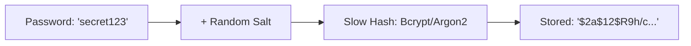

# SEC.6 Password Hashing

## Mission

Master the secure storage of user passwords. Learn why you must **Never Store Plaintext Passwords**, why generic hashes like MD5 or SHA-256 are dangerous for passwords, and how to use **Bcrypt** or **Argon2** to protect user data even if your database is stolen.

## Prerequisites

- None (Foundational concept).

## Mental Model

Think of Password Hashing as **A One-Way Shredder**.

1. **Plaintext (The Document)**: The user's password. It's readable and private.
2. **The Shredder (The Hash)**: You put the document in the shredder. It comes out as a pile of unreadable confetti. You can't turn the confetti back into the document. (One-way property).
3. **Verification**: When the user logs in again, they give you a *copy* of their password. You shred the copy. If the new pile of confetti looks exactly like the old pile, the passwords were the same.
4. **The Slow Gear (Work Factor)**: Imagine the shredder is hand-cranked and takes 10 seconds to process one page. This is fine for one user logging in, but it makes it impossible for a thief to try millions of passwords a second (Brute Force).

## Visual Model



## Machine View

- **Salt**: A random string added to the password before hashing. It ensures that two users with the password `123456` will have different hashes, preventing "Rainbow Table" attacks.
- **Work Factor (Cost)**: A parameter that controls how much CPU time it takes to compute the hash. As computers get faster, you increase the cost to keep attacks slow.
- **Dedicated Algorithms**: Use `bcrypt`, `scrypt`, or `argon2`. **Never use MD5, SHA-1, or SHA-256 for passwords**-they are designed to be fast, which is the opposite of what you want for passwords.

## Run Instructions

```bash
# Run the demo to compare hashing speeds and security
go run ./09-architecture/04-security/6-password-hashing
```

## Code Walkthrough

### Using `golang.org/x/crypto/bcrypt`
Shows how to hash a password using `GenerateFromPassword` and how to verify it using `CompareHashAndPassword`.

### Generic Hash vs. Bcrypt
A benchmark that compares how many SHA-256 hashes a computer can do per second vs. how many Bcrypt hashes. You will see that SHA-256 is thousands of times faster, making it vulnerable to brute-force attacks.

## Try It

1. Look at `main.go`. Try to use a very high "Cost" (e.g., 31) for Bcrypt. Notice how your computer slows down significantly.
2. Try to verify a password using a different salt. Does it work?
3. Discuss: If a user forgets their password, can the admin "recover" it from the database? Why is this a good thing for security?

## In Production
**Bcrypt is the industry standard for Go.** Use it for all user passwords. Store the resulting string directly in your database. If you have extremely high security needs, consider **Argon2**, which is designed to be resistant to GPU-based cracking. Always use a cost of at least 10 or 12.

## Thinking Questions
1. Why do we need a "Salt"?
2. What is a "Pepper," and how is it different from a Salt?
3. How do you handle "Password Rotation" if you want to switch from Bcrypt to Argon2?

## Next Step

Next: `SEC.7` -> `09-architecture/04-security/7-rate-limiting-patterns`

Open `09-architecture/04-security/7-rate-limiting-patterns/README.md` to continue.
