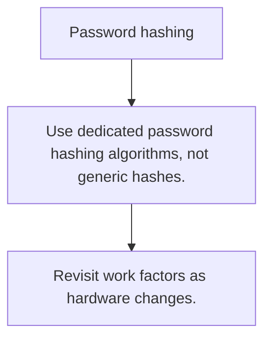

# SEC.6 Password hashing

## Mission

Learn why passwords need one-way hashing with slow work factors instead of reversible encryption.

## Prerequisites

- SEC.5

## Mental Model

Passwords should be verified, not decrypted.

## Visual Model



## Machine View

Password hashing algorithms deliberately spend CPU and memory so stolen hashes are harder to brute-force offline.

## Run Instructions

```bash
go run ./09-architecture/04-security/6-password-hashing
```

## Code Walkthrough

### Use dedicated password hashing algorithms, not generic

Use dedicated password hashing algorithms, not generic hashes.

### Store the hash and parameters, never the plaintext pas

Store the hash and parameters, never the plaintext password.

### Revisit work factors as hardware changes.

Revisit work factors as hardware changes.

## Try It

1. Change one of the example inputs and rerun the lesson.
2. Explain which boundary the lesson is trying to make explicit.
3. Describe how you would apply SEC.6 in a small service or tool.

## ⚠️ In Production

Hashing policy is security policy: weak parameters make a correct library call functionally useless.

## 🤔 Thinking Questions

1. What problem does this topic solve?
2. What breaks if this boundary is handled implicitly instead of explicitly?
3. Where would you expect to use this topic in production Go code?

## Next Step

Continue to `SEC.7`.
