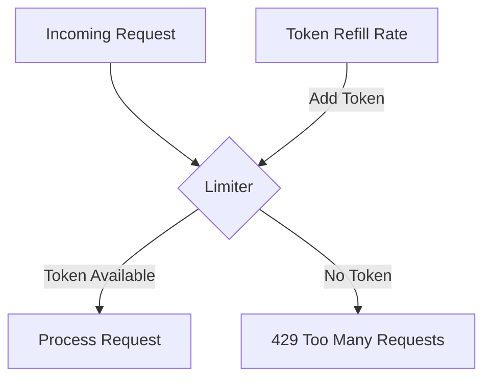

# SEC.7 Rate Limiting Patterns

## Mission

Master Rate Limiting to protect your service from abuse, DoS attacks, and "noisy neighbor" problems. Learn how to implement the **Token Bucket** algorithm in Go and how to choose the right strategy (IP-based, User-based, or Global) for different parts of your application.

## Prerequisites

- Section 07: Concurrency (Understanding `time.Ticker` and Channels)

## Mental Model

Think of Rate Limiting as **A Water Dispenser with a Small Cup**.

1. **The Bucket (The Limit)**: The dispenser has a reservoir (The Bucket) that can hold 5 gallons (The Burst).
2. **The Refill (The Rate)**: Water flows into the reservoir at a rate of 1 gallon per minute (The Sustained Rate).
3. **The Request**: A user comes with a cup and takes some water.
4. **The Throttling**: If 10 people come at once, they can take all 5 gallons immediately (A Burst). But then, the next person has to wait for the reservoir to refill. If they try to take water faster than it refills, they are "Rate Limited."

## Visual Model



## Machine View

- **Token Bucket Algorithm**: A standard algorithm that allows for bursts of traffic while maintaining a steady long-term rate.
- **`golang.org/x/time/rate`**: The standard Go package for rate limiting. It provides a thread-safe implementation of the Token Bucket.
- **Storage**: For a single instance, in-memory limiters are fine. For a distributed system, you use a shared store like **Redis** to track limits across all servers.

## Run Instructions

```bash
# Run the demo to see how requests are throttled
go run ./09-architecture/04-security/7-rate-limiting-patterns
```

## Code Walkthrough

### Global Rate Limiting
Shows a simple middleware that limits the entire server to 10 requests per second.

### Per-User Rate Limiting
Demonstrates a more advanced pattern where each User (identified by their API Key or IP address) has their own individual bucket. This prevents one malicious user from blocking everyone else.

### The 429 Response
Shows how to return a `429 Too Many Requests` status code and a `Retry-After` header, which tells the client when they can try again.

## Try It

1. Look at `main.go`. Change the "Burst" size to 1. Notice how you can no longer send even a small burst of requests.
2. Implement a "Tiered" rate limit: Free users get 5 req/sec, Pro users get 100 req/sec.
3. Discuss: Why should you use an IP-based rate limit for your "Login" page?

## In Production
**Rate limit your most expensive endpoints.** Auth checks, search queries, and database writes are prime targets for abuse. Always monitor your "429" error rates; if they are too high, your limits might be too strict for your legitimate users. In a production environment, you often offload rate limiting to your **API Gateway** (e.g., Kong, NGINX, or AWS WAF) before the request even reaches your Go code.

## Thinking Questions
1. What is the difference between "Hard Limiting" and "Soft Limiting" (Throttling)?
2. How do you handle "Distributed Rate Limiting" without creating a bottleneck in Redis?
3. What is a "Leaky Bucket" algorithm, and how does it differ from a "Token Bucket"?

## Next Step

Next: `SEC.8` -> `09-architecture/04-security/8-tls-and-https-in-go`

Open `09-architecture/04-security/8-tls-and-https-in-go/README.md` to continue.
