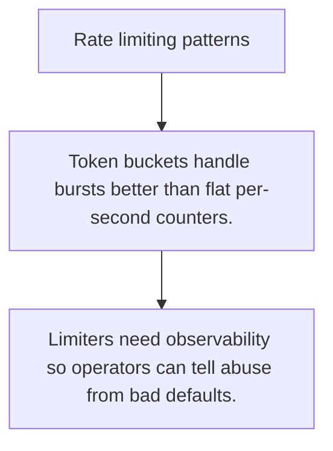

# SEC.7 Rate limiting patterns

## Mission

Learn how token bucket and similar controls protect shared resources from abuse and accidental overload.

## Prerequisites

- SEC.6

## Mental Model

Rate limiting is resource budgeting for shared systems.

## Visual Model



## Machine View

A limiter turns unlimited arrival pressure into an explicit policy about what volume is allowed over time.

## Run Instructions

```bash
go run ./09-architecture/04-security/7-rate-limiting-patterns
```

## Code Walkthrough

### Token buckets handle bursts better than flat per-secon

Token buckets handle bursts better than flat per-second counters.

### Choose rate keys carefully: IP, user, API key, or tena

Choose rate keys carefully: IP, user, API key, or tenant.

### Limiters need observability so operators can tell abus

Limiters need observability so operators can tell abuse from bad defaults.

## Try It

1. Change one of the example inputs and rerun the lesson.
2. Explain which boundary the lesson is trying to make explicit.
3. Describe how you would apply SEC.7 in a small service or tool.

## ⚠️ In Production

Rate limits protect both your service and the dependencies behind it, especially on auth, search, and write-heavy endpoints.

## 🤔 Thinking Questions

1. What problem does this topic solve?
2. What breaks if this boundary is handled implicitly instead of explicitly?
3. Where would you expect to use this topic in production Go code?

## Next Step

Continue to `SEC.8`.
