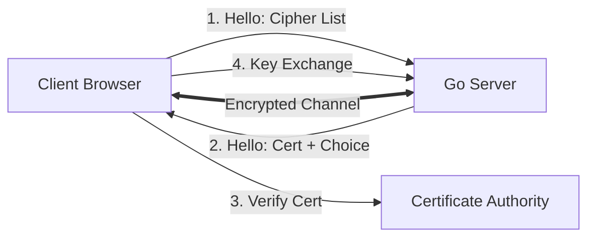

# SEC.8 TLS and HTTPS in Go

## Mission

Master Transport Layer Security (TLS) to ensure your data is always encrypted and your servers are verified. Learn how to configure a secure **HTTPS Server** in Go, understand how **Certificates** work, and learn how to use **Modern Cipher Suites** while avoiding legacy, vulnerable protocols.

## Prerequisites

- Section 06: Web Servers (Basics of `http.ListenAndServe`)

## Mental Model

Think of TLS as **A Secure Armored Truck**.

1. **The Request (The Message)**: You want to send a letter to a friend.
2. **Plain HTTP (The Postcard)**: Anyone who handles the letter (ISPs, hackers on public Wi-Fi) can read it or change it.
3. **HTTPS (The Armored Truck)**: The message is put inside a safe that only your friend can open (Encryption). The truck itself has a verified license and ID (Certificate) that proves it actually belongs to your friend's company (Authentication).
4. **The Handshake**: Before anything is sent, you and your friend agree on the lock type and the key (TLS Handshake).

## Visual Model



## Machine View

- **`crypto/tls`**: Go's standard library for TLS. It is highly optimized and secure by default.
- **`ListenAndServeTLS`**: The function used to start an HTTPS server. It requires a `certFile` and a `keyFile`.
- **Cipher Suites**: The specific algorithms used for encryption. Modern Go versions automatically prefer secure ones (like TLS 1.3).
- **HSTS (HTTP Strict Transport Security)**: A header that tells the browser to *only* use HTTPS for your site in the future.

## Run Instructions

```bash
# Run the demo to start a local HTTPS server with a self-signed cert
go run ./09-architecture/04-security/8-tls-and-https-in-go
```

## Code Walkthrough

### Starting an HTTPS Server
Shows how to use `http.ListenAndServeTLS` with a generated self-signed certificate. You will see how to handle the "Insecure Connection" warning in your browser.

### Custom TLS Config
Demonstrates how to use `tls.Config` to restrict the server to **TLS 1.2 or higher** and disable weak ciphers. This is a common requirement for high-security environments like banking or healthcare.

### HTTP to HTTPS Redirect
Shows a common pattern where a server listens on port 80 (HTTP) only to redirect all users to port 443 (HTTPS).

## Try It

1. Run the demo. Try to access the server using `http://` instead of `https://`. What happens?
2. Use `curl -v` to inspect the TLS handshake. Can you see the TLS version and the Cipher Suite?
3. Discuss: Why should you use "Let's Encrypt" instead of self-signed certificates in production?

## In Production
**Encryption is not optional.** Use HTTPS for everything. In production, you typically don't manage certificates in your Go code; you use a **Reverse Proxy** (like NGINX, Caddy, or an AWS Load Balancer) to "terminate" TLS. This allows your Go code to run as plain HTTP behind a secure perimeter. If you must handle TLS in Go, use a library like `autocert` to automate certificate renewal via Let's Encrypt.

## Thinking Questions
1. What is the difference between Symmetric and Asymmetric encryption?
2. How does a "Man-in-the-Middle" (MITM) attack work on plain HTTP?
3. What is "Mutual TLS" (mTLS), and when would you use it?

## Next Step

Next: `SEC.9` -> `09-architecture/04-security/9-secrets-management`

Open `09-architecture/04-security/9-secrets-management/README.md` to continue.
