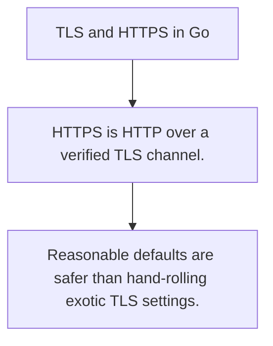

# SEC.8 TLS and HTTPS in Go

## Mission

Learn the transport-level rules that turn plain HTTP into encrypted, identity-checked HTTPS.

## Prerequisites

- SEC.7

## Mental Model

TLS protects the channel by encrypting traffic and authenticating the server identity with certificates.

## Visual Model



## Machine View

Certificates, trust stores, cipher policy, and handshake behavior sit below the application payload but still shape application safety.

## Run Instructions

```bash
go run ./09-architecture/04-security/8-tls-and-https-in-go
```

## Code Walkthrough

### HTTPS is HTTP over a verified TLS channel.

HTTPS is HTTP over a verified TLS channel.

### Certificate validation is part of the trust model, not

Certificate validation is part of the trust model, not an optional extra.

### Reasonable defaults are safer than hand-rolling exotic

Reasonable defaults are safer than hand-rolling exotic TLS settings.

## Try It

1. Change one of the example inputs and rerun the lesson.
2. Explain which boundary the lesson is trying to make explicit.
3. Describe how you would apply SEC.8 in a small service or tool.

## ⚠️ In Production

Transport security is not optional on hostile networks, and misconfiguration can silently remove the safety you thought you had.

## 🤔 Thinking Questions

1. What problem does this topic solve?
2. What breaks if this boundary is handled implicitly instead of explicitly?
3. Where would you expect to use this topic in production Go code?

## Next Step

Continue to `SEC.9`.
