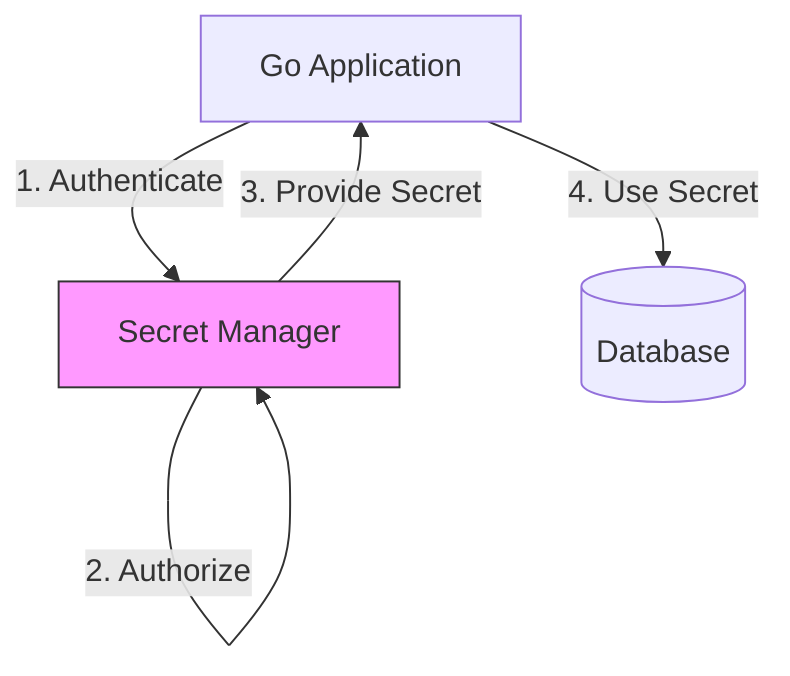

# SEC.9 Secrets Management

## Mission

Master the art of keeping your application's secrets (API keys, database passwords, private keys) secure. Learn why you should **Never Commit Secrets to Git**, how to use **Environment Variables** for configuration, and how to integrate with **Secret Managers** (like HashiCorp Vault or AWS Secrets Manager) for production-grade security.

## Prerequisites

- None (Foundational concept).

## Mental Model

Think of Secrets Management as **Managing the Keys to a Safe**.

1. **The Secret (The Key)**: This is the physical key that opens your safe.
2. **The Vulnerability (Commiting to Git)**: Leaving the key in the lock, or worse, making a hundred copies and leaving them on every desk in the office. Anyone who walks in can take a copy.
3. **The Solution (Environment Variables)**: You keep the key in your pocket. Only you have it while you are in the office. When you leave, the key goes with you.
4. **The Professional Solution (Secret Manager)**: You put the key in a digital locker. To get the key, you have to prove who you are (Authentication) and explain why you need it (Audit Log). The locker can also change the lock on your safe every week (Rotation) automatically.

## Visual Model



## Machine View

- **Environment Variables**: The standard way to pass configuration to a process. Accessible in Go via `os.Getenv()`.
- **`.env` files**: Used for local development (via libraries like `godotenv`). **Must be added to `.gitignore`.**
- **In-Memory Safety**: Once a secret is loaded into a variable, it lives in the process memory. Be careful not to print these variables to logs or include them in error messages.
- **Rotation**: The practice of changing a secret regularly. This limits the damage if a secret is ever leaked.

## Run Instructions

```bash
# Run the demo to see how to load secrets from the environment
go run ./09-architecture/04-security/9-secrets-management
```

## Code Walkthrough

### Loading from Environment
Shows how to use `os.Getenv` with a fallback for local development. Demonstrates the "Fail-fast" pattern: if a required secret (like `DB_PASSWORD`) is missing, the application should crash immediately with a clear error.

### The "Log Leak" Danger
Shows how a simple `fmt.Printf("%+v", config)` can accidentally leak an API key to the console or a log file. Demonstrates how to use a custom `String()` method or a "Redacted" type to prevent this.

## Try It

1. Look at `main.go`. Try to run the app without setting any environment variables. What happens?
2. Set an environment variable in your terminal (e.g., `export MY_SECRET=hello` on Mac/Linux or `$env:MY_SECRET="hello"` on Windows) and rerun the app.
3. Discuss: If you accidentally commit a secret to Git, is it enough to just delete the line and make a new commit? (Hint: Check the Git history).

## In Production
**Git is forever.** If you ever commit a secret, consider it compromised. Rotate the secret immediately. In production, use your cloud provider's secret manager (AWS Secrets Manager, GCP Secret Manager, Azure Key Vault) or a dedicated tool like HashiCorp Vault. Never hard-code "test" credentials in your source code.

## Thinking Questions
1. Why are Environment Variables better than hard-coded strings?
2. What is "Secret Rotation," and why is it important?
3. How can you use a `.gitignore` file to protect your team?

## Next Step

Next: `SEC.10` -> `09-architecture/04-security/10-owasp-top-10-for-go`

Open `09-architecture/04-security/10-owasp-top-10-for-go/README.md` to continue.
