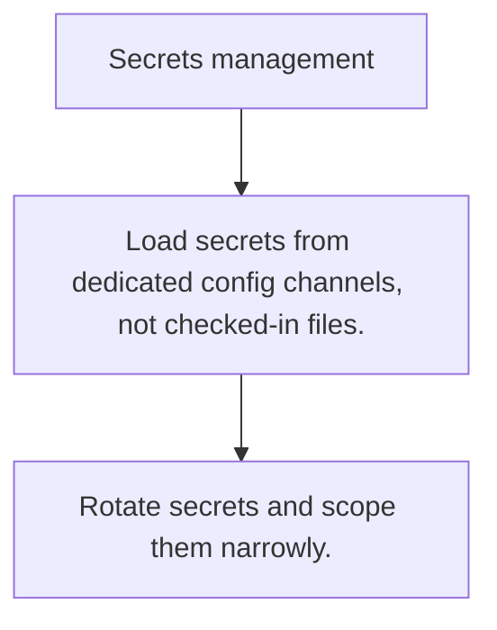

# SEC.9 Secrets management

## Mission

Learn how to keep credentials, keys, and tokens out of source control, logs, and casual developer workflows.

## Prerequisites

- SEC.8

## Mental Model

A secret is any value that grants access or trust if an attacker obtains it.

## Visual Model



## Machine View

Secrets move through config loading, process memory, deployment systems, and logging surfaces.

## Run Instructions

```bash
go run ./09-architecture/04-security/9-secrets-management
```

## Code Walkthrough

### Load secrets from dedicated config channels, not check

Load secrets from dedicated config channels, not checked-in files.

### Never log secret material intentionally or accidentall

Never log secret material intentionally or accidentally.

### Rotate secrets and scope them narrowly.

Rotate secrets and scope them narrowly.

## Try It

1. Change one of the example inputs and rerun the lesson.
2. Explain which boundary the lesson is trying to make explicit.
3. Describe how you would apply SEC.9 in a small service or tool.

## ⚠️ In Production

Most secret leaks are boring process failures, not cryptographic failures: committed files, copied logs, and reused credentials.

## 🤔 Thinking Questions

1. What problem does this topic solve?
2. What breaks if this boundary is handled implicitly instead of explicitly?
3. Where would you expect to use this topic in production Go code?

## Next Step

Continue to `SEC.10`.
