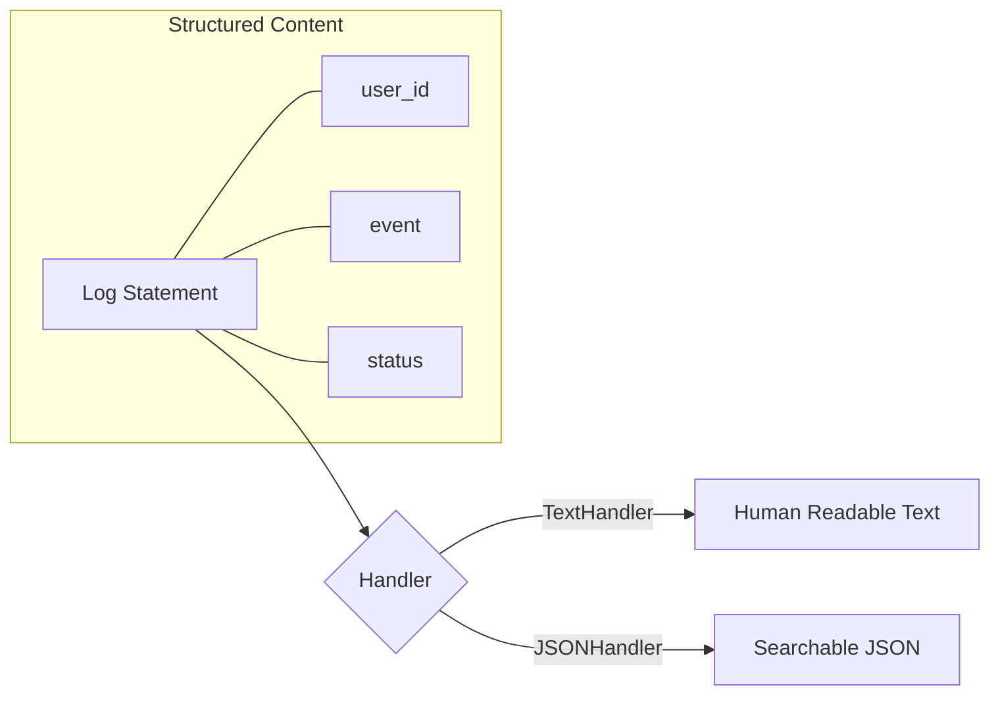

# SL.1 slog Basics

## Mission

Master the core API of `log/slog`. Learn how to replace generic `fmt.Println` or `log.Printf` with structured **Key-Value Pairs**, understand the difference between **Text** and **JSON** handlers, and learn how to use **Log Levels** (Info, Debug, Warn, Error) to control noise in production.

## Prerequisites

- None (Foundational operational concept).

## Mental Model

Think of Structured Logging as **Moving from a Diary to a Spreadsheet**.

1. **The Diary (Traditional Logging)**: "User #123 logged in from IP 1.2.3.4 at 10:00 AM." (Hard to search).
2. **The Spreadsheet (Structured Logging)**:
   | Time | Event | UserID | IP |
   | --- | --- | --- | --- |
   | 10:00 AM | login | 123 | 1.2.3.4 |
3. **The Advantage**: In a spreadsheet, you can instantly filter for "All logins from IP 1.2.3.4" or "All events for User #123." In a diary, you have to read every page manually.

## Visual Model



## Machine View

- **`slog.Info()`**: A high-level helper that takes a message followed by variadic key-value pairs.
- **Attributes**: Use `slog.String`, `slog.Int`, etc., for type-safe and zero-allocation logging in high-performance paths.
- **JSON Handler**: The standard for production. Every log line is a valid JSON object, making it natively compatible with nearly all log aggregators.

## Run Instructions

```bash
# Run the demo to see the difference between Text and JSON output
go run ./10-production/01-structured-logging/1-slog-basics
```

## Code Walkthrough

### The Default Logger
Shows how `slog.Info` looks right out of the box (standard text).

### Switching to JSON
Demonstrates how to set a global logger that outputs everything as JSON.

### Using Attributes
Shows the difference between `slog.Info("msg", "key", val)` and the more performant `slog.LogAttrs` pattern.

## Try It

1. Look at `main.go`. Change the log level to `slog.LevelDebug`. Can you see the debug logs now?
2. Add a custom attribute `environment: production` to every log line using `slog.With()`.
3. Discuss: Why should you never put a User's Password in a log line?

## In Production
**Set your log level via configuration.** Use an environment variable (SEC.9) to set the level to `INFO` in production and `DEBUG` in staging. Use the `JSONHandler` so your logs can be parsed by your monitoring stack. Avoid "Big Blob" logs where a single key contains a massive JSON string; break it down into searchable top-level keys instead.

## Thinking Questions
1. What is the benefit of a `JSONHandler` over a `TextHandler`?
2. Why is "Leveling" important for cost control in logging?
3. How does `slog` differ from the standard `log` package in Go?

## Next Step

Next: `SL.2` -> `10-production/01-structured-logging/2-context-logger`

Open `10-production/01-structured-logging/2-context-logger/README.md` to continue.
