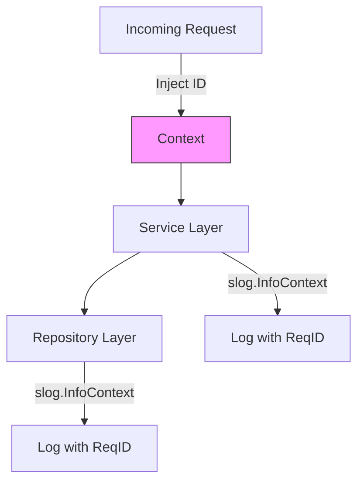

# SL.2 Context Logging

## Mission

Master the propagation of log context. Learn how to use `context.Context` to carry attributes like **Request IDs**, **User IDs**, and **Trace IDs** throughout your application, ensuring that every log line emitted during a single request can be correlated together.

## Prerequisites

- SL.1 slog Basics
- Section 07: Concurrency (Understanding `context.Context`)

## Mental Model

Think of Context Logging as **A Shared Clipboard**.

1. **The Entry Point**: When a request starts, you write the `RequestID` on the clipboard.
2. **The Hand-off**: As the request moves through different functions and services, you pass the clipboard along.
3. **The Log**: Whenever someone wants to log something, they look at the clipboard first and include the `RequestID` in their log message.
4. **The Result**: You can now search for "Every log line that shares this specific RequestID" and see exactly what happened during that one user's visit.

## Visual Model



## Machine View

- **`slog.InfoContext()`**: Similar to `Info()`, but it takes a `context.Context` as the first argument.
- **Context Attributes**: Go's `slog` doesn't automatically pull values from the context. You must implement a **Handler** that knows how to look for specific keys in the context and add them to the log record.
- **Correlation**: The primary goal is correlation. Without context logging, if two users log in at the same time, their log lines will be mixed together, and you won't know which error belongs to which user.

## Run Instructions

```bash
# Run the demo to see how IDs are propagated through layers
go run ./10-production/01-structured-logging/2-context-logger
```

## Code Walkthrough

### Injecting into Context
Shows how to create a custom key and use `context.WithValue` to store a unique Request ID.

### The Context-Aware Middleware
Demonstrates a real-world pattern where an HTTP middleware generates a Request ID for every incoming request and stores it in the context.

### The Logger Interceptor
Shows a simple `slog.Handler` wrapper that extracts the ID from the context and adds it as a top-level attribute to every log record.

## Try It

1. Look at `main.go`. Call the service multiple times. Notice how each "session" has its own unique ID.
2. Add a `UserID` to the context and update the handler to log both `request_id` and `user_id`.
3. Discuss: Why should you avoid putting large objects (like a full `User` struct) into the context for logging?

## In Production
**Don't rely on global variables.** In a concurrent Go server, global variables will be shared across all requests, leading to data races and incorrect logs. Always pass the `context.Context` through your function signatures. This is the "Standard Go Way" to handle per-request state.

## Thinking Questions
1. Why doesn't `slog` automatically support context values out of the box?
2. What is the performance cost of extracting values from a context for every log line?
3. How do you handle "Sensitive" context values that should never be logged?

## Next Step

Next: `SL.3` -> `10-production/01-structured-logging/3-custom-handler`

Open `10-production/01-structured-logging/3-custom-handler/README.md` to continue.
