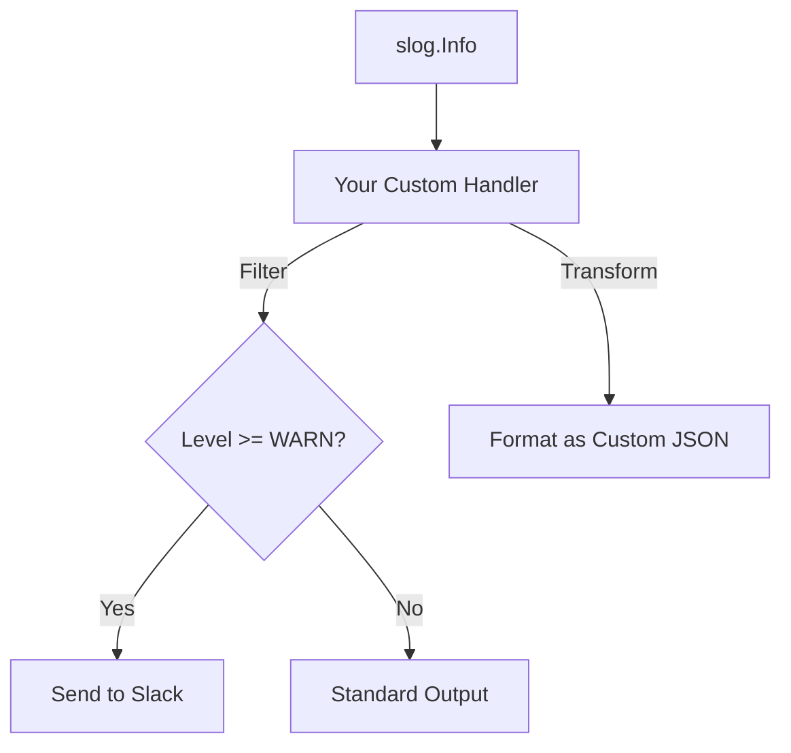

# SL.3 Custom Handlers

## Mission

Master the `slog.Handler` interface. Learn how to intercept log records and redirect them to custom destinations like **Slack**, **Elasticsearch**, or a specialized **File Rotation** system. Understand how to transform, filter, and enrich log data before it is emitted.

## Prerequisites

- SL.2 Context Logging

## Mental Model

Think of a Custom Handler as **A Post Office Sorting Facility**.

1. **The Package (The Record)**: Every log line is a package containing information (time, level, message, attributes).
2. **The Sorter (The Handler)**: The facility receives the package and decides where it goes.
3. **The Destination**:
   - Packages marked "ERROR" go to the Slack notification truck.
   - Packages marked "INFO" go to the central Database archive.
   - Packages marked "DEBUG" are shredded (ignored) if we are in production.

## Visual Model



## Machine View

- **`Handle(ctx, record)`**: The core method you must implement. It receives a `slog.Record` and is responsible for outputting it.
- **`Enabled(ctx, level)`**: Allows you to perform high-performance filtering. If this returns `false`, the expensive `Handle` method is never called.
- **`WithAttrs()` and `WithGroup()`**: Methods used to create "Child" loggers with persistent attributes. Your handler must correctly support these to be compatible with the full `slog` ecosystem.

## Run Instructions

```bash
# Run the demo to see a custom Slack-style handler in action
go run ./10-production/01-structured-logging/3-custom-handler
```

## Code Walkthrough

### The `slog.Handler` Interface
A deep dive into the four methods required to build a compliant handler.

### The "Notice" Handler
Shows a real-world example of a handler that only triggers on `LevelWarn` and `LevelError`, sending a notification to a simulated external service.

### Formatting Logic
Demonstrates how to manually iterate over the attributes in a `slog.Record` and format them into a custom string or JSON structure.

## Try It

1. Look at `main.go`. Modify the custom handler to add a timestamp in a unique format (e.g., `YYYY/MM/DD`).
2. Implement a "Redaction" handler that automatically replaces any attribute named "email" with `[REDACTED]`.
3. Discuss: Why should you avoid making blocking network calls (like an HTTP POST to Slack) directly inside the `Handle` method? (Hint: Think about concurrency).

## In Production
**Performance matters.** The `Handle` method is called every time your application logs. If your handler is slow or performs disk I/O synchronously, it will slow down your entire application. Always use **Asynchronous Processing** (e.g., a worker pool or a channel) for slow destinations like remote APIs or databases.

## Thinking Questions
1. What is the difference between a `Handler` and a `Logger`?
2. How do you "Chain" multiple handlers together (e.g., Log to File AND Log to Console)?
3. Why does `slog.Record` use a specialized iterator instead of a simple map for attributes?

## Next Step

`slog` is the new standard, but older libraries still dominate many projects. Learn how they compare. Continue to [SL.4 Zerolog Comparison](../4-zerolog-comparison).
