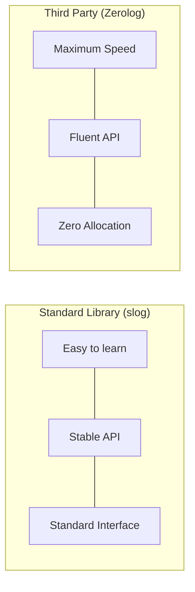

# SL.4 Zerolog Comparison

## Mission

Understand the ecosystem beyond the standard library. Compare `log/slog` with **Zerolog**, one of the most popular third-party logging libraries in the Go ecosystem. Learn how to identify when the standard library is "enough" and when a specialized library is required for extreme performance or specific developer ergonomics.

## Prerequisites

- SL.1 slog Basics

## Mental Model

Think of the difference as **A Swiss Army Knife vs. A Scalpel**.

1. **`log/slog` (Swiss Army Knife)**: Built into Go. It's safe, standardized, and handles 95% of use cases perfectly. Everyone on the team already has it.
2. **Zerolog (Scalpel)**: Specialized for one thing: **Extreme JSON Performance**. It uses zero-allocation techniques and a very specific "Fluent" API to be the fastest JSON logger in existence.
3. **The Trade-off**: Zerolog is faster and has a different syntax, but it's an external dependency. `slog` is standard but slightly slower in extreme edge cases.

## Visual Model



## Machine View

- **Fluent API**: Zerolog uses a chain of methods: `log.Info().Str("key", "val").Msg("hello")`.
- **Zero Allocations**: Zerolog achieves its speed by writing directly to the output buffer without creating temporary objects (like the attribute structs used in `slog`).
- **Bridge Handlers**: You can often use a "Bridge" to make a library like Zerolog act as the backend for `slog`, giving you the best of both worlds: a standard interface with a high-performance implementation.

## Run Instructions

```bash
# Run the comparison to see the syntax differences
go run ./10-production/01-structured-logging/4-zerolog-comparison
```

## Code Walkthrough

### The Zerolog Syntax
Shows how to initialize a Zerolog logger and use its unique method-chaining API.

### Side-by-Side Comparison
Demonstrates the same log operation (Level, Message, 3 Attributes) implemented in both `slog` and `zerolog`.

### Performance Hints
Discusses the internal mechanics of how Zerolog avoids memory allocations during logging.

## Try It

1. Look at `main.go`. Try to add a nested object (a sub-JSON object) using both libraries. Which syntax do you prefer?
2. Benchmarking (Advanced): Run a simple benchmark to see the throughput difference between the two.
3. Discuss: If `slog` exists, why would a new project choose Zerolog?

## In Production
**Favor the Standard Library unless you have a proven performance bottleneck.** In modern cloud environments (Kubernetes, AWS Lambda), the cost of the network transfer or the log storage is usually 100x more expensive than the CPU cost of the logging library itself. Only switch to Zerolog if your service is processing millions of requests per second and every microsecond of CPU time counts.

## Thinking Questions
1. What does "Zero Allocation" mean in the context of logging?
2. Why is a Fluent API (method chaining) popular for logging libraries?
3. How do external dependencies impact the long-term maintainability of a Go project?

## Next Step

Next: `SL.5` -> `10-production/01-structured-logging/5-exercise`

Open `10-production/01-structured-logging/5-exercise/README.md` to continue.
