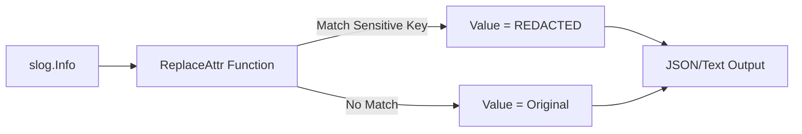

# SL.5 PII Redactor

## Mission

Master the `ReplaceAttr` pattern. Build a high-performance logger that automatically redacts sensitive attributes like **passwords**, **emails**, and **credit cards** before they are emitted to the output stream. Learn how to implement centralized compliance rules that protect your users from accidental data leaks.

## Prerequisites

- SL.1 slog Basics
- SL.3 Custom Handlers (Understanding the Handler lifecycle)

## Mental Model

Think of this as **A Blackout Marker for your Logs**.

1. **The Writer**: A developer writes `slog.Info("Login attempt", "user", "alice", "password", "secret123")`.
2. **The Interceptor**: Before the log is printed, your `ReplaceAttr` function scans the keys.
3. **The Action**: If a key matches a sensitive list (like "password"), it swaps the value for `[REDACTED]`.
4. **The Security**: The actual secret never hits the disk, the network, or the log aggregator.

## Visual Model



## Machine View

- **`slog.HandlerOptions`**: The configuration struct for built-in handlers. It contains the `ReplaceAttr` field.
- **`ReplaceAttr func(groups []string, a slog.Attr) slog.Attr`**: This function is called for every attribute in every log record.
- **Zero Allocation**: While `ReplaceAttr` can be powerful, be careful not to create new strings or objects in every call, as this will significantly increase the memory pressure on your application.

## Run Instructions

```bash
# Run the exercise to verify your redaction logic
go test -v ./10-production/01-structured-logging/5-exercise
```

## Solution Walkthrough

- **Defining Sensitive Keys**: Shows how to create a reusable slice of strings that represents your "Blacklist."
- **Implementing ReplaceAttr**: Demonstrates the core logic: checking the `a.Key` and returning a modified `slog.Attr` if it matches the blacklist.
- **The Global Setup**: Shows how to apply these options to a global `JSONHandler` so that all logs in the application are protected.

## Try It

1. Look at `_starter/main.go`. Complete the `ReplaceAttr` implementation so that the "password" and "ssn" fields are redacted.
2. Add a rule that transforms all keys to **lowercase** before logging them.
3. Discuss: How would you handle a situation where a developer logs sensitive data inside a nested group (e.g., `user.auth.password`)?

## Verification Surface

- Use `go test -v ./10-production/01-structured-logging/5-exercise`.
- Starter path: `10-production/01-structured-logging/5-exercise/_starter`.


## In Production
**Don't "Just Be Careful."** Logging Personally Identifiable Information (PII) is a major compliance violation (GDPR, HIPAA, SOC2). When a secret leaks into logs, it is retained for months and accessible to many engineers. The `ReplaceAttr` pattern is your **Safety Net**. It ensures that no matter how tired or rushed a developer is, the system will prevent a massive security incident.

## Thinking Questions
1. Why is centralized redaction better than manual redaction at the call site?
2. What happens if a developer logs a secret in the **Message** string instead of an attribute?
3. How can you handle different redaction rules for different log levels (e.g., log full details in DEBUG but redact in INFO)?

## Next Step

Congratulations! You've mastered Structured Logging. Now learn how to shut down your system without dropping any of these logs. Continue to [GS.1 Signal Handling](../../02-graceful-shutdown/1-signal-context).
