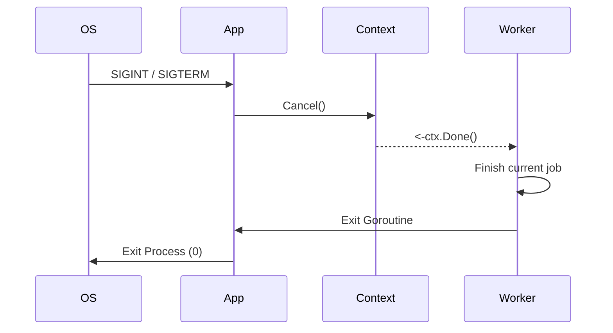

# GS.1 Signal Context

## Mission

Master OS signal handling in Go. Learn how to listen for **SIGINT** (Ctrl+C) and **SIGTERM** (Kubernetes stop) and transform them into a **Canceled Context**. This pattern allows your entire application to start shutting down concurrently as soon as a stop signal is received.

## Prerequisites

- Section 07: Concurrency (Understanding `context.Context`)

## Mental Model

Think of Signal Handling as **A Fire Alarm in a Building**.

1. **The Signal**: Someone pulls the alarm (The OS sends `SIGTERM`).
2. **The Notification**: The bells start ringing throughout the building (The context is canceled).
3. **The Response**: Everyone stops what they are doing and heads for the exits in an orderly fashion (Your goroutines finish their work and return).
4. **The Alternative**: If you don't have an alarm, the building just collapses (The OS kills your process instantly), and people get trapped inside (Data is corrupted or lost).

## Visual Model



## Machine View

- **`os.Signal`**: A type representing an operating system signal.
- **`signal.NotifyContext()`**: A helper that returns a copy of the parent context that is marked done when one of the specified signals is received.
- **`SIGTERM` vs `SIGKILL`**: You can catch `SIGTERM` and shut down gracefully. You **cannot** catch `SIGKILL` (kill -9); the OS will terminate you immediately.

## Run Instructions

```bash
# Run the app and then press Ctrl+C to see it shut down gracefully
go run ./10-production/02-graceful-shutdown/1-signal-context
```

## Code Walkthrough

### The Global Context
Shows how to wrap your `main` function's logic in a context created by `signal.NotifyContext`.

### The Blocking Wait
Demonstrates how to use `<-ctx.Done()` to wait for the signal without spinning the CPU.

### The Cleanup Phase
Shows the logic that runs *after* the signal is received but *before* the program exits.

## Try It

1. Run the program. Press `Ctrl+C`. Notice how it prints a "Goodbye" message before exiting.
2. Modify the code to wait for 2 seconds after the signal is received to simulate a "Slow Cleanup."
3. Discuss: What happens if you receive a *second* `Ctrl+C` while the first one is still being processed? (Hint: Check the `stop()` function returned by `NotifyContext`).

## In Production
**Kubernetes uses SIGTERM.** When you update a deployment, K8s sends a `SIGTERM` to your pod. It then waits for a "Termination Grace Period" (default 30s). If your app is still running after that, it sends a `SIGKILL`. Your goal is to finish all active work and exit within that grace period.

## Thinking Questions
1. Why is `context` the best way to propagate a shutdown signal?
2. What are the most common signals a Go developer needs to care about?
3. What is the danger of a `main` function that exits immediately upon receiving a signal?

## Next Step

A canceled context tells workers to stop, but an HTTP server needs special handling to stop accepting new requests while finishing old ones. Continue to [GS.2 HTTP Server Shutdown](../2-http-server).
