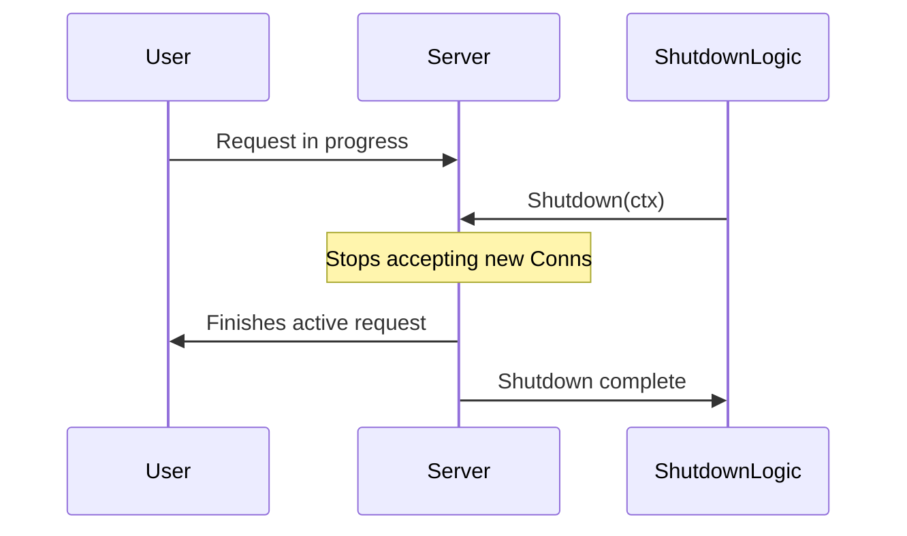

# GS.2 HTTP Server Shutdown

## Mission

Master graceful shutdown for web services. Learn how to use the `http.Server.Shutdown()` method to stop accepting new requests while allowing active requests to finish processing. Understand the importance of using a **Timeout Context** to ensure your server doesn't hang forever if a request is stuck.

## Prerequisites

- GS.1 Signal Context
- Section 06: Backend & APIs (Basic `http.ListenAndServe` knowledge)

## Mental Model

Think of Graceful Shutdown as **Closing a Restaurant for the Night**.

1. **The Signal**: It's 10:00 PM (You receive `SIGTERM`).
2. **Locking the Doors**: You lock the front door (The server stops accepting new HTTP connections).
3. **Finishing the Meals**: The people already sitting at tables are allowed to finish their meals (Active requests are processed to completion).
4. **The Cleanup**: Once the last guest leaves, you turn off the lights and go home (The `Shutdown()` call returns).
5. **The Deadline**: If someone is still eating at 11:00 PM, you politely ask them to leave (The timeout context expires, and you force the exit).

## Visual Model



## Machine View

- **`http.Server.Shutdown(ctx)`**: This method gracefully shuts down the server without interrupting any active connections. It works by closing all open listeners, then closing all idle connections, and then waiting indefinitely for connections to return to idle and then shut down.
- **The Timeout**: You **must** pass a context with a timeout to `Shutdown()`. If you don't, and a client holds a connection open indefinitely, your application will never exit.
- **`http.ErrServerClosed`**: When `Shutdown` is called, any active `ListenAndServe` calls will immediately return this specific error. You should check for it to avoid logging a false-positive "Server Error."

## Run Instructions

```bash
# Run the server
go run ./10-production/02-graceful-shutdown/2-http-server
# In another terminal, make a request that takes 5 seconds:
# curl http://localhost:8080/slow
# Now press Ctrl+C in the server terminal. Notice how it waits for the request to finish.
```

## Code Walkthrough

### The Server Struct
Shows why you must use `&http.Server{}` instead of the shortcut `http.ListenAndServe`.

### Running in a Goroutine
Demonstrates why the server must run in its own goroutine so the main thread can wait for the shutdown signal.

### The Draining Phase
Shows how to create a 5-second timeout context and pass it to `server.Shutdown()`.

## Try It

1. Run the server and make a `/slow` request. Press `Ctrl+C`. Verify that the browser receives the response before the server exits.
2. Reduce the shutdown timeout to 1 second. Run the `/slow` request again. What happens?
3. Discuss: Why do we need to check `if err != http.ErrServerClosed`?

## In Production
**Set your timeouts carefully.** If your longest API request takes 10 seconds, your shutdown timeout should be at least 15 seconds. If you are using WebSockets or long-lived streams (Track GR), `Shutdown()` will wait for them to close. You may need to manually close those connections using the `BaseContext` or a separate signaling mechanism.

## Thinking Questions
1. What is the difference between `server.Close()` and `server.Shutdown()`?
2. How does the server know which requests are "active"?
3. Why is it important to use a separate context for the `Shutdown` call?

## Next Step

It's time to coordinate the shutdown of multiple resources at once. Continue to [GS.3 Resource Cleanup Exercise](../3-capstone).
