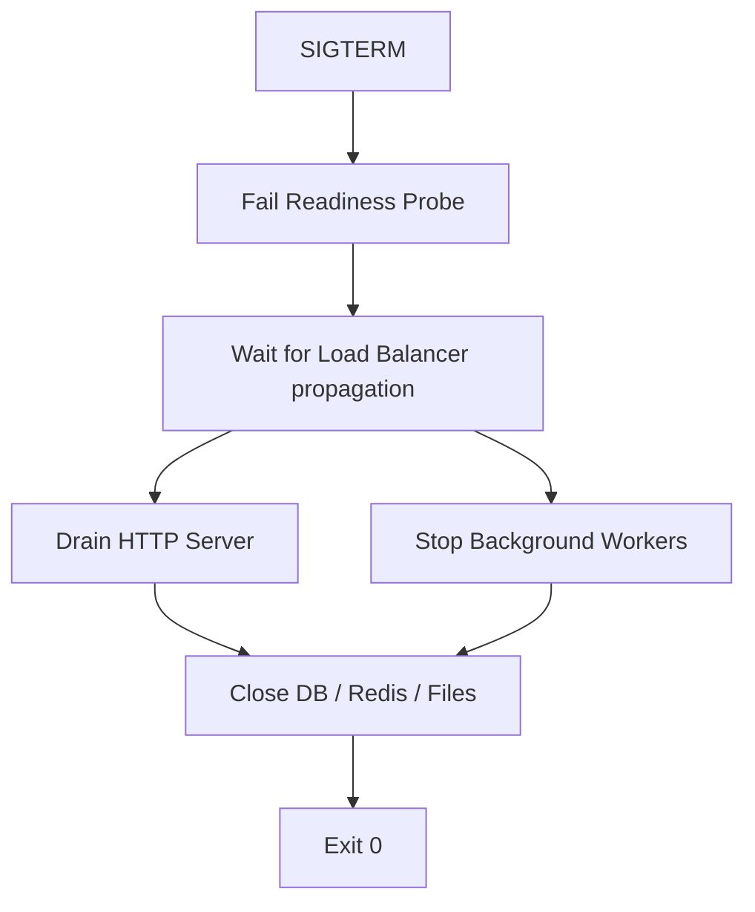

# GS.3 Shutdown Capstone

## Mission

Coordinate the shutdown of a complex system. Learn how to manage the **Shutdown Dependency Graph**: flipping readiness probes, draining HTTP connections, stopping background workers, and finally closing database connections. Use `golang.org/x/sync/errgroup` to coordinate these concurrent tasks cleanly and reliably.

## Prerequisites

- GS.1 Signal Context
- GS.2 HTTP Server Shutdown
- Section 07: Concurrency (Understanding `errgroup`)

## Mental Model

Think of the Capstone as **Closing a Factory**.

1. **The Stop Order**: The manager says "Stop taking new orders" (Receive `SIGTERM`).
2. **The Guard**: The front gate is closed so no more trucks can enter (Readiness probe flips to "Down").
3. **The Workers**: The workers on the assembly line finish the products they are currently holding (Background workers finish their jobs).
4. **The Shipping**: The products already packed are loaded onto the remaining trucks (HTTP server drains active requests).
5. **The Power**: Finally, you turn off the main power generator (Close the Database/Redis connections).

## Visual Model



## Machine View

- **Dependency Order**: Resources must be closed in the **Reverse Order** they were opened. If your Service depends on the DB, you must stop the Service before you close the DB.
- **ErrGroup**: A powerful abstraction that allows you to start multiple goroutines and wait for all of them to finish. It also handles the "First Error" propagation.
- **Readiness Probes**: In Kubernetes, a failing readiness probe tells the service mesh (like Istio) or the load balancer to stop sending new traffic to this specific instance *before* it starts shutting down.

## Run Instructions

```bash
# Run the capstone and press Ctrl+C
go run ./10-production/02-graceful-shutdown/3-capstone
```

## Solution Walkthrough

- **The Shutdown Coordinator**: Demonstrates how to use `signal.NotifyContext` and `errgroup` to manage the entire lifecycle.
- **The Readiness Handler**: Shows a simple atomic flag that can be toggled to signal to the outside world that the service is shutting down.
- **The Dependency Sequence**: Walks through the logic that ensures the Database is only closed *after* the HTTP server and workers are done using it.

## Try It

1. Run the code. Observe the order of the log lines. Does it match the Mental Model?
2. Add a new "Resource" (like a File Logger) that must be closed at the very end.
3. Discuss: What happens if the Readiness Probe isn't integrated with your load balancer?

## Verification Surface

- Use `go run ./10-production/02-graceful-shutdown/3-capstone`.
- Starter path: `10-production/02-graceful-shutdown/3-capstone/_starter`.

## In Production
**Test your shutdown sequence!** Many teams write perfect startup logic but never actually test what happens during a `SIGTERM`. Use a load-testing tool (like `k6` or `hey`) to send traffic to your service while you trigger a restart. If you see any 5xx errors, your graceful shutdown is broken.

## Thinking Questions
1. Why must the Readiness Probe fail *before* the HTTP server starts shutting down?
2. What is the "Termination Grace Period" in Kubernetes, and why does it matter?
3. How do you handle a background worker that refuses to stop?

## Next Step

Congratulations! You've mastered the runtime operations of a Go service. Now learn how to configure it for different environments. Continue to [Track CFG: Configuration](../../04-configuration).
