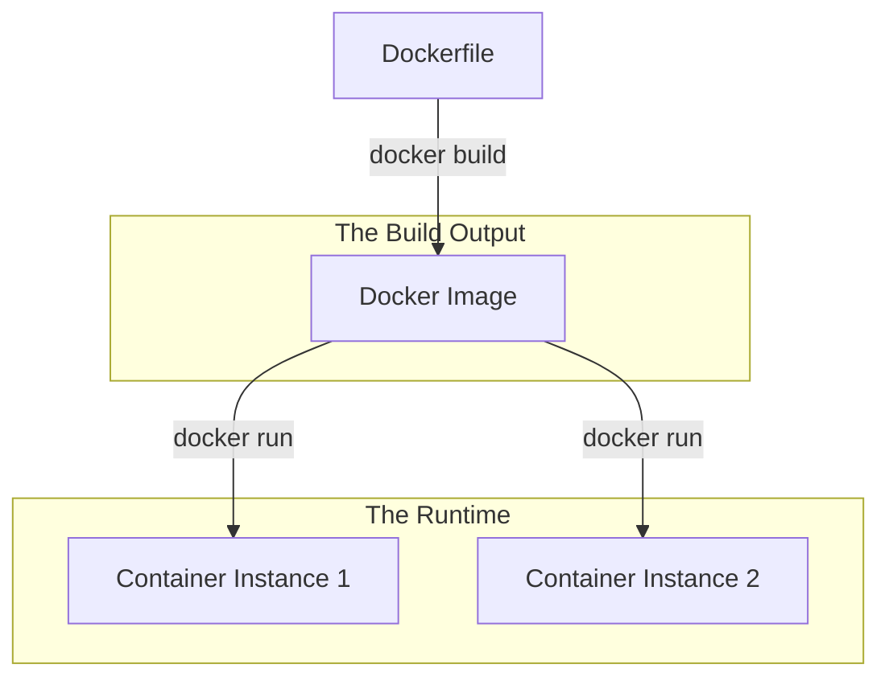

# DOCKER.1 Docker Basics

## Mission

Master the fundamentals of containerization. Learn the difference between an **Image** and a **Container**, how to write a simple `Dockerfile` for a Go application, and how to use `docker build` and `docker run` to package and execute your code in an isolated environment.

## Prerequisites

- None.

## Mental Model

Think of Docker as **A Shipping Container**.

1. **The Goods (The Code)**: Your Go binary.
2. **The Manifest (The Dockerfile)**: The list of instructions on how to pack the goods (e.g., "Install Go," "Copy code," "Compile").
3. **The Container (The Image)**: The sealed, standardized steel box that contains the binary and all its dependencies.
4. **The Ship (The Docker Runtime)**: The infrastructure that carries and runs the container. It doesn't care if the container contains a Go app, a Python script, or a Database; it just knows how to move it.

## Visual Model



## Machine View

- **Layer Caching**: Each line in a `Dockerfile` creates a "Layer." If you change a file, only the layers *after* that change need to be rebuilt.
- **Isolation**: A container has its own network stack, filesystem, and process space, separated from the host OS via Linux namespaces and cgroups.
- **Immutable**: Once an image is built, it cannot be changed. You must build a new image if you change the code.

## Run Instructions

```bash
# Build the image (Assuming Docker is installed)
# docker build -t my-go-app ./10-production/03-docker-and-deployment/1-docker-basics

# Run the container
# docker run --rm my-go-app
```

## Code Walkthrough

### The Basic Dockerfile
Shows the most common instructions: `FROM` (base image), `WORKDIR`, `COPY`, `RUN go build`, and `CMD`.

### Image Tags
Demonstrates how to name and version your images using the `-t` flag.

### Port Mapping
Explains how to map a port on your local machine to a port inside the container using `-p`.

## Try It

1. Create a `Dockerfile` for the simple app in `main.go`.
2. Build the image and run it. Verify the output.
3. Add an environment variable (CFG.1) to the `docker run` command using the `-e` flag.
4. Discuss: Why is the `FROM golang:1.22` image so large (nearly 1GB)?

## In Production
**Never use `latest`.** Always tag your images with a specific version number or the Git commit hash. Using `latest` makes your deployments non-deterministic-you might deploy a different version of the code than you intended because the `latest` tag was updated by someone else.

## Thinking Questions
1. What is the difference between an Image and a Container?
2. Why is "Layer Caching" important for fast CI/CD pipelines?
3. What happens to the files inside a container when it is stopped?

## Next Step

Next: `DOCKER.2` -> `10-production/03-docker-and-deployment/2-multi-stage-builds`

Open `10-production/03-docker-and-deployment/2-multi-stage-builds/README.md` to continue.
