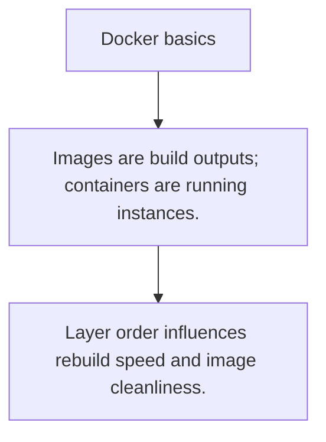

# DOCKER.1 Docker basics

## Mission

Learn the basic building blocks of images, containers, layers, and Dockerfiles.

## Prerequisites

- none

## Mental Model

A Docker image is a packaged filesystem and startup contract; a container is one running instance of that package.

## Visual Model



## Machine View

Each Dockerfile instruction creates a cached layer that affects image size, build speed, and security posture.

## Run Instructions

```bash
go run ./10-production/03-docker-and-deployment/1-docker-basics
```

## Code Walkthrough

### Images are build outputs; containers are running insta

Images are build outputs; containers are running instances.

### Dockerfiles describe how the image is assembled.

Dockerfiles describe how the image is assembled.

### Layer order influences rebuild speed and image cleanli

Layer order influences rebuild speed and image cleanliness.

## Try It

1. Change one of the example inputs and rerun the lesson.
2. Explain which boundary the lesson is trying to make explicit.
3. Describe how you would apply DOCKER.1 in a small service or tool.

## ⚠️ In Production

Container basics matter because deployment packaging changes startup, debugging, and runtime assumptions.

## 🤔 Thinking Questions

1. What problem does this topic solve?
2. What breaks if this boundary is handled implicitly instead of explicitly?
3. Where would you expect to use this topic in production Go code?

## Next Step

Continue to `DOCKER.2`.
