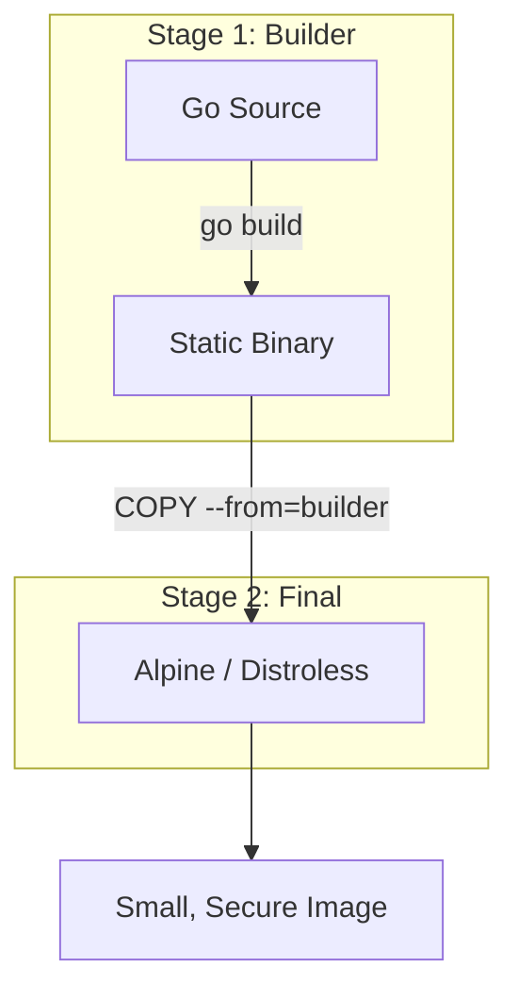

# DOCKER.2 Multi-stage Builds

## Mission

Master production-grade containerization. Learn how to use **Multi-stage Builds** to create minimal, secure Docker images by separating your build environment (the Go compiler) from your production environment (the Go binary). Understand why Go's ability to compile into a static binary makes it perfect for "Distroless" and "Scratch" images.

## Prerequisites

- DOCKER.1 Docker Basics

## Mental Model

Think of Multi-stage Builds as **A Kitchen and a Dining Room**.

1. **The Kitchen (Builder Stage)**: You have flour, eggs, pans, and a hot oven. It's messy and full of tools (Go compiler, source code, caches).
2. **The Dining Room (Final Stage)**: You only bring the finished cake (The Go binary) to the table. You don't bring the oven, the leftover flour, or the dirty pans.
3. **The Advantage**: The dining room is clean, safe, and small. If a burglar enters the dining room, they can't find a knife (The shell/package manager) to cause trouble.

## Visual Model



## Machine View

- **Static Linking**: Go binaries can be compiled with `CGO_ENABLED=0` to ensure they have zero dependencies on system libraries (like glibc).
- **COPY --from**: The magic command that allows you to reach into a previous stage and grab only the specific file you need.
- **Image Size**: A single-stage Go image is ~800MB. A multi-stage image using `alpine` is ~15MB. A multi-stage image using `scratch` is ~10MB.

## Run Instructions

```bash
# Build the multi-stage image
# docker build -t my-slim-app ./10-production/03-docker-and-deployment/2-multi-stage-builds

# Compare the size with a standard image
# docker images
```

## Code Walkthrough

### The Builder Stage
Shows how to name a stage (`AS builder`) and perform a production-ready build with flags like `-ldflags="-s -w"`.

### The Final Stage
Demonstrates using a minimal base image like `alpine` or `gcr.io/distroless/static`.

### Security Best Practices
Shows why you should run your application as a **Non-root User** inside the container.

## Try It

1. Build the app using a multi-stage Dockerfile. How much smaller is the final image compared to DOCKER.1?
2. Try using `FROM scratch` as the final stage. (Hint: You'll need to set `CGO_ENABLED=0`).
3. Discuss: Why is a smaller image faster to deploy in a cloud environment?

## In Production
**Use Distroless.** Distroless images contain only your application and its runtime dependencies. They do not contain package managers, shells, or any other programs you would expect to find in a standard Linux distribution. This drastically reduces the **Attack Surface** of your application. If there is no shell, an attacker cannot run `ls`, `curl`, or `rm` even if they find a vulnerability in your code.

## Thinking Questions
1. Why do we need a compiler in the build stage but not in the final stage?
2. What is a "Static Binary," and why is it important for Docker?
3. How does a multi-stage build protect your source code?

## Next Step

Now that you can package a single service, learn how to manage multiple services and databases together. Continue to [DOCKER.3 Docker Compose](../3-docker-compose).
