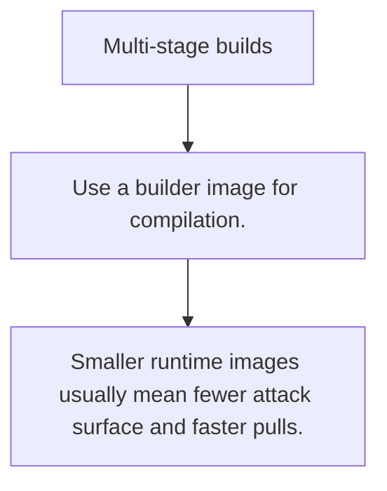

# DOCKER.2 Multi-stage builds

## Mission

Learn why Go binaries fit naturally into multi-stage builds that separate compile tools from runtime images.

## Prerequisites

- DOCKER.1

## Mental Model

One stage builds the binary; a later stage runs only the binary and minimal runtime assets.

## Visual Model



## Machine View

Build stages let the compiler and dependency cache exist where needed without bloating the final runtime image.

## Run Instructions

```bash
go run ./10-production/03-docker-and-deployment/2-multi-stage-builds
```

## Code Walkthrough

### Use a builder image for compilation.

Use a builder image for compilation.

### Copy only the resulting binary into the runtime image.

Copy only the resulting binary into the runtime image.

### Smaller runtime images usually mean fewer attack surfa

Smaller runtime images usually mean fewer attack surface and faster pulls.

## Try It

1. Change one of the example inputs and rerun the lesson.
2. Explain which boundary the lesson is trying to make explicit.
3. Describe how you would apply DOCKER.2 in a small service or tool.

## ⚠️ In Production

Multi-stage builds reduce both artifact size and the number of unnecessary tools shipped into production.

## 🤔 Thinking Questions

1. What problem does this topic solve?
2. What breaks if this boundary is handled implicitly instead of explicitly?
3. Where would you expect to use this topic in production Go code?

## Next Step

Continue to `DOCKER.3`.
