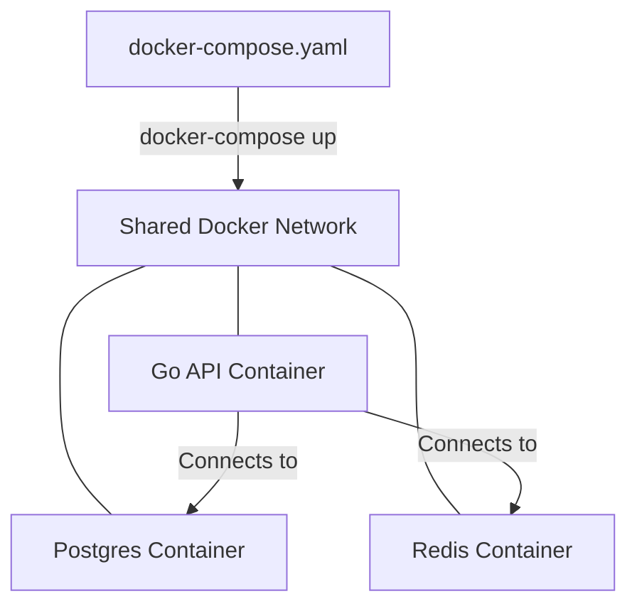

# DOCKER.3 Docker Compose

## Mission

Master local orchestration. Learn how to use **Docker Compose** to manage multiple related containers-such as a Go API, a PostgreSQL database, and a Redis cache-as a single unit. Understand how to define networks, volumes, and environment variables in a `docker-compose.yaml` file to create a reproducible development environment.

## Prerequisites

- DOCKER.2 Multi-stage Builds

## Mental Model

Think of Docker Compose as **A Band Conductor**.

1. **The Musicians (The Containers)**: Each one is an expert at their own instrument (Go app, DB, Cache).
2. **The Sheet Music (docker-compose.yaml)**: The instructions that tell every musician what to play and when to start.
3. **The Performance (The Project)**: Instead of the audience (The developer) having to start each musician one by one, the conductor taps their baton (`docker-compose up`), and the entire band starts playing together in harmony.
4. **The Advantage**: The conductor ensures everyone is on the same stage (The Network) and can hear each other.

## Visual Model



## Machine View

- **Service Names as Hostnames**: Inside the Docker network, your Go app can connect to the database using the name `db` instead of an IP address.
- **Volumes**: These allow you to persist data (like your database files) even if the container is deleted.
- **Depends On**: This ensures that your Go app doesn't try to start until the database is "Ready" (or at least "Started").

## Run Instructions

```bash
# Start the entire environment
# docker-compose up -d

# View logs for all services
# docker-compose logs -f

# Shut everything down and remove volumes
# docker-compose down -v
```

## Code Walkthrough

### The Compose File
Shows a standard `docker-compose.yaml` structure with services, networks, and volumes.

### Environment Variable Injection
Demonstrates how Compose can pass secrets and configuration (CFG.1) from your host machine into the containers.

### Health Checks
Shows how to use `healthcheck` in Compose to ensure the database is actually ready before the Go app starts.

## Try It

1. Run `docker-compose up`. Try to connect to the Go API from your browser.
2. Stop the database container manually. Observe how the Go API responds.
3. Add a new service (e.g., `adminer` or `pgadmin`) to the Compose file to visualize the database.
4. Discuss: Why is it better to use Compose for local development than a local Kubernetes cluster?

## In Production
**Don't use Docker Compose for production scaling.** While Compose is excellent for local development and small single-server deployments, it lacks the advanced features of an orchestrator like **Kubernetes** or **Amazon ECS**, such as auto-scaling, self-healing (restarting on different nodes), and rolling updates across a cluster of machines.

## Thinking Questions
1. How do containers communicate with each other in a Compose environment?
2. What is the difference between a "Named Volume" and a "Bind Mount"?
3. Why should you use a `.env` file with Docker Compose?

## Next Step

Packaging is done. Now learn how to automate the path from "Code Push" to "Live Service." Continue to [DEPLOY.1 CI/CD Pipelines](../4-cicd-pipelines).
