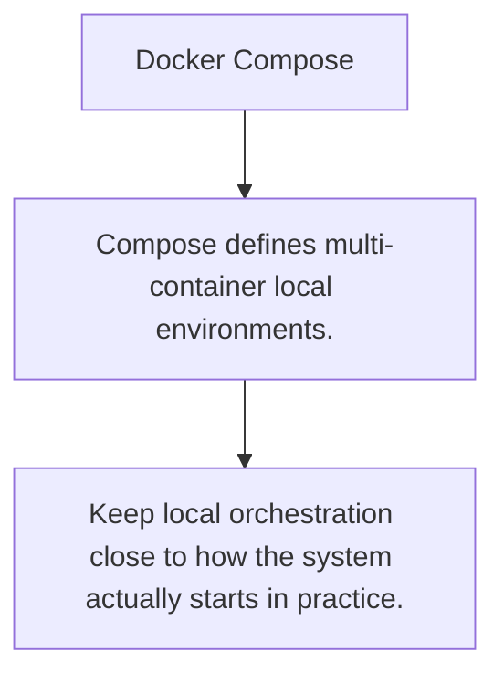

# DOCKER.3 Docker Compose

## Mission

Learn how Compose coordinates multiple services, shared networks, and local environment defaults for development.

## Prerequisites

- DOCKER.2

## Mental Model

Compose is a local orchestration description for how related containers should run together.

## Visual Model



## Machine View

Service names, ports, volumes, and dependency ordering turn a set of containers into one developer environment.

## Run Instructions

```bash
go run ./10-production/03-docker-and-deployment/3-docker-compose
```

## Code Walkthrough

### Compose defines multi-container local environments.

Compose defines multi-container local environments.

### Networks and named services remove manual wiring work.

Networks and named services remove manual wiring work.

### Keep local orchestration close to how the system actua

Keep local orchestration close to how the system actually starts in practice.

## Try It

1. Change one of the example inputs and rerun the lesson.
2. Explain which boundary the lesson is trying to make explicit.
3. Describe how you would apply DOCKER.3 in a small service or tool.

## ⚠️ In Production

Compose is helpful when a service is only meaningful next to its database, cache, or queue and local startup should be boring.

## 🤔 Thinking Questions

1. What problem does this topic solve?
2. What breaks if this boundary is handled implicitly instead of explicitly?
3. Where would you expect to use this topic in production Go code?

## Next Step

Continue to `DEPLOY.1`.
