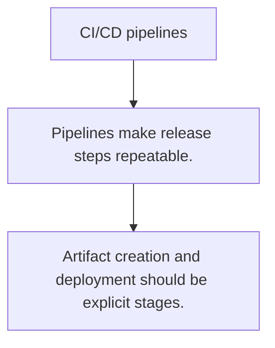

# DEPLOY.1 CI/CD pipelines

## Mission

Learn how automated build, test, package, and deploy stages turn repository changes into controlled releases.

## Prerequisites

- DOCKER.3

## Mental Model

A pipeline is a repeatable release process written down as automation instead of tribal knowledge.

## Visual Model



## Machine View

Each stage guards the next: verify code, build artifacts, publish packages, and promote to an environment.

## Run Instructions

```bash
go run ./10-production/03-docker-and-deployment/4-cicd-pipelines
```

## Code Walkthrough

### Pipelines make release steps repeatable.

Pipelines make release steps repeatable.

### Quality gates should fail early and clearly.

Quality gates should fail early and clearly.

### Artifact creation and deployment should be explicit st

Artifact creation and deployment should be explicit stages.

## Try It

1. Change one of the example inputs and rerun the lesson.
2. Explain which boundary the lesson is trying to make explicit.
3. Describe how you would apply DEPLOY.1 in a small service or tool.

## ⚠️ In Production

CI/CD is valuable because it removes hidden release steps and makes quality gates visible before production.

## 🤔 Thinking Questions

1. What problem does this topic solve?
2. What breaks if this boundary is handled implicitly instead of explicitly?
3. Where would you expect to use this topic in production Go code?

## Next Step

Continue to `DEPLOY.2`.
