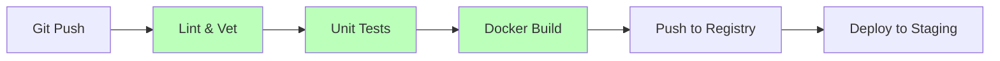

# DEPLOY.1 CI/CD Pipelines

## Mission

Master the "Automated Factory." Learn how to build a **Continuous Integration (CI)** and **Continuous Deployment (CD)** pipeline that automatically tests, builds, and packages your Go application on every code push. Understand how to use **GitHub Actions** (or similar tools) to create "Quality Gates" that prevent broken code from ever reaching production.

## Prerequisites

- DOCKER.1 Docker Basics
- Section 08: Quality & Testing (Unit and Integration tests)

## Mental Model

Think of a CI/CD Pipeline as **An Automated Assembly Line**.

1. **The Trigger (Git Push)**: A worker puts a new part on the line.
2. **The Inspector (CI - Tests)**: Automated machines check the part for defects (Run `go test`, `go vet`, `golangci-lint`). If it fails, the line stops immediately.
3. **The Packager (CI - Build)**: If the part is good, it is automatically put into a standard shipping box (Build the Docker Image).
4. **The Warehouse (Registry)**: The box is stored in a secure location (Docker Hub / AWS ECR).
5. **The Delivery (CD - Deploy)**: A truck automatically picks up the box and delivers it to the customer (Deploy to Production).

## Visual Model



## Machine View

- **YAML Configuration**: Pipelines are usually defined as code (e.g., `.github/workflows/ci.yaml`).
- **Runners**: These are the virtual machines or containers where your pipeline steps actually execute.
- **Secrets Management**: Pipelines need access to sensitive data (like Docker Hub passwords or Cloud API keys), which must be stored securely as "Secrets," never in the source code.

## Run Instructions

```bash
# Since we can't run a full GitHub Action locally, we simulate the pipeline steps:
go vet ./...
go test -v ./...
# docker build .
```

## Code Walkthrough

### The Pipeline Definition
Shows a sample GitHub Actions workflow for a Go project.

### Quality Gates
Demonstrates how to make the pipeline fail if test coverage drops below a certain percentage.

### Multi-Environment Strategy
Explains how to deploy to "Staging" automatically but require a manual approval for "Production."

## Try It

1. Examine the provided `.github/workflows/main.yaml` file.
2. Intentionally break a test and push to a branch. Observe the pipeline failing.
3. Add a new step to the pipeline that runs a security scanner like `gosec`.
4. Discuss: Why should you never deploy code that hasn't passed through a CI pipeline?

## In Production
**Test in the same environment you run.** Your CI pipeline should build the Docker image and then run your **Integration Tests** *against that image*. If you run tests on your local machine's Go version but deploy a different version in Docker, you risk "It works on CI but fails in Production" bugs.

## Thinking Questions
1. What is the difference between Continuous Delivery and Continuous Deployment?
2. Why is "Failing Fast" important in a CI pipeline?
3. How do you handle database migrations in an automated pipeline?

## Next Step

Automation makes deployment fast. Now learn how to make it safe. Continue to [DEPLOY.2 Blue/Green & Rollback](../5-blue-green-and-rollback).
