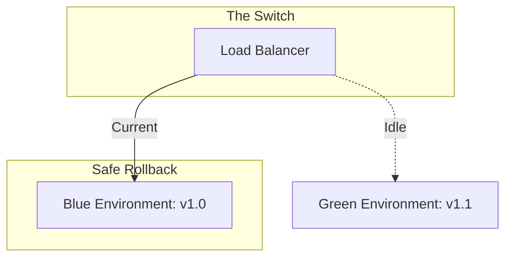

# DEPLOY.2 Blue/Green & Rollback

## Mission

Master the "Safe Cutover." Learn how to manage the risk of releasing new code to users. Understand **Blue/Green Deployment** (running two identical environments) and **Rolling Updates** (updating instances one by one). Learn how to implement automated **Health Checks** and how to perform a 1-click **Rollback** when things go wrong in production.

## Prerequisites

- DEPLOY.1 CI/CD Pipelines
- GS.2 HTTP Graceful Drain

## Mental Model

Think of Blue/Green Deployment as **A New Bridge**.

1. **Blue (The Old Bridge)**: All traffic is currently crossing the old bridge.
2. **Green (The New Bridge)**: You build a brand new bridge right next to the old one. It's finished, but no cars are allowed on it yet.
3. **The Test**: You send a few test vehicles across the Green bridge to make sure it's solid.
4. **The Cutover**: You move the traffic cones. All cars now start using the Green bridge.
5. **The Rollback**: If the Green bridge starts shaking, you move the cones back to the Blue bridge instantly. The old bridge is still there, ready to go.
6. **The Cleanup**: Once you're 100% sure the Green bridge is safe, you can tear down the Blue one.

## Visual Model



## Machine View

- **Immutable Infrastructure**: Instead of updating code on a running server, you create a brand new server/container with the new code.
- **Health Checks**: The Load Balancer periodically pings a `/health` or `/ready` endpoint. It only sends traffic to containers that return `200 OK`.
- **Draining**: When you turn off the "Blue" environment, you must wait for existing connections to finish (GS.2) before killing the processes.

## Run Instructions

```bash
# Run the simulation to see how a load balancer switches between versions
go run ./10-production/03-docker-and-deployment/5-blue-green-and-rollback
```

## Code Walkthrough

### The Health Check Endpoint
Shows how to implement a `/health` handler that checks database connectivity and system status.

### The Readiness vs Liveness Pattern
Explains the difference between "I am alive" (Liveness) and "I am ready to handle traffic" (Readiness).

### The Rollback Script
Demonstrates a simple script that can revert the Load Balancer to the previous version's image tag.

## Try It

1. Run the simulation. Trigger a failure in the "Green" environment and watch the automated rollback.
2. Implement a `/ready` endpoint that returns a `503 Service Unavailable` if the database connection pool is full.
3. Discuss: Why is Blue/Green deployment more expensive than a Rolling Update? (Hint: You need 2x the servers during the cutover).

## In Production
**Beware of Database Migrations.** Blue/Green deployment is easy for stateless code, but difficult for databases. If your "Green" code migrates the database schema, your "Blue" code might stop working. Always use **Two-Phase Migrations** (Add column first, then use it) to ensure that both the old and new code can run against the same database during the cutover.

## Thinking Questions
1. What is the main advantage of Blue/Green over Rolling Updates?
2. How do "Canary Releases" differ from Blue/Green?
3. Why is a "Health Check" more than just checking if the process is running?

## Next Step

You have the tools and the strategies. Now put it all together in a final containerization challenge. Continue to [DEPLOY.3 Dockerised Service](../6-dockerised-service).
