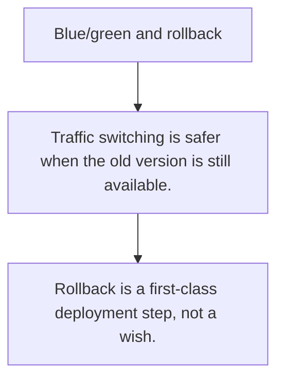

# DEPLOY.2 Blue/green and rollback

## Mission

Learn rollout strategies that reduce downtime and give operators a clear path back when a release is bad.

## Prerequisites

- DEPLOY.1

## Mental Model

A deployment strategy is really a risk-management strategy for switching traffic between application versions.

## Visual Model



## Machine View

Blue/green keeps two environments ready so traffic can move predictably; rollback plans matter because releases are never perfect.

## Run Instructions

```bash
go run ./10-production/03-docker-and-deployment/5-blue-green-and-rollback
```

## Code Walkthrough

### Traffic switching is safer when the old version is sti

Traffic switching is safer when the old version is still available.

### Health checks and drain windows shape safe cutovers.

Health checks and drain windows shape safe cutovers.

### Rollback is a first-class deployment step, not a wish.

Rollback is a first-class deployment step, not a wish.

## Try It

1. Change one of the example inputs and rerun the lesson.
2. Explain which boundary the lesson is trying to make explicit.
3. Describe how you would apply DEPLOY.2 in a small service or tool.

## ⚠️ In Production

Zero-downtime claims are only meaningful when rollback, health checks, and drain behavior are planned together.

## 🤔 Thinking Questions

1. What problem does this topic solve?
2. What breaks if this boundary is handled implicitly instead of explicitly?
3. Where would you expect to use this topic in production Go code?

## Next Step

Continue to `DEPLOY.3`.
