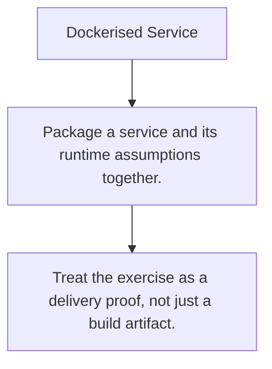

# DEPLOY.3 Dockerised Service

## Mission

Package one service shape with config, container build, and rollout thinking into a single exercise surface.

## Prerequisites

- DOCKER.1
- DOCKER.2
- DOCKER.3
- DEPLOY.1
- DEPLOY.2

## Mental Model

A deployment exercise proves that the code, container, and operating assumptions agree with each other.

## Visual Model



## Machine View

The final artifact is not just a binary. It is a runtime contract about config, networking, health, and startup behavior.

## Run Instructions

```bash
go run ./10-production/03-docker-and-deployment/6-dockerised-service
```

## Solution Walkthrough

- Package a service and its runtime assumptions together.
- Make startup, config, and health behavior explicit.
- Treat the exercise as a delivery proof, not just a build artifact.

## Verification Surface

- Use `go run ./10-production/03-docker-and-deployment/6-dockerised-service`.
- Starter path: `10-production/03-docker-and-deployment/6-dockerised-service/_starter`.

## Try It

1. Change one of the example inputs and rerun the lesson.
2. Explain which boundary the lesson is trying to make explicit.
3. Describe how you would apply DEPLOY.3 in a small service or tool.

## ⚠️ In Production

Production readiness is a property of the whole delivery path, not just the application source.

## 🤔 Thinking Questions

1. What problem does this topic solve?
2. What breaks if this boundary is handled implicitly instead of explicitly?
3. Where would you expect to use this topic in production Go code?

## Next Step

After `DEPLOY.3`, continue to [CG.1 go generate Primer](../../06-code-generation/1-go-generate).
