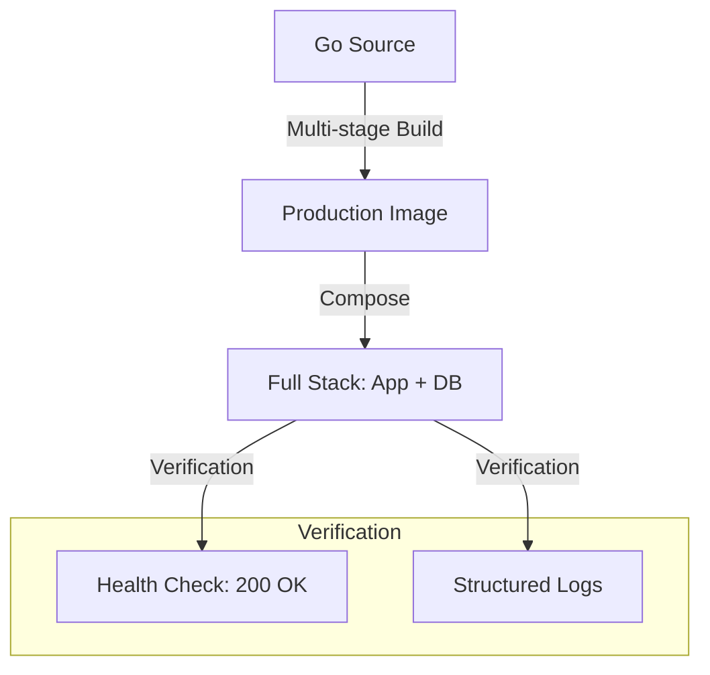

# DEPLOY.3 Exercise: Dockerised Service

## Mission

Put your containerization and deployment knowledge into practice. Your mission is to take a raw Go API and transform it into a production-ready **Dockerised Service**. You must implement a multi-stage `Dockerfile`, coordinate the service with a database using `docker-compose`, and ensure the application correctly handles configuration, health checks, and graceful shutdown.

## Prerequisites

- DOCKER.1 - DOCKER.3
- DEPLOY.1 - DEPLOY.2
- GS.2 HTTP Graceful Drain
- CFG.1 Environment Variables

## Mental Model

Think of this exercise as **Opening a New Franchise**.

1. **The Recipe (The Code)**: You have the instructions for making the product.
2. **The Store Design (The Dockerfile)**: You must design a standardized store layout that can be built anywhere.
3. **The Utility Connections (Docker Compose)**: You must ensure the store has water, electricity, and gas (Database, Cache, Network) before opening.
4. **The Health Inspector (Health Checks)**: You must have a way to prove the store is safe and ready for customers.
5. **The Goal**: A perfectly packaged franchise that can be "opened" in any city (Cloud Provider) with a single command.

## Visual Model



## Machine View

- **`_starter/`**: Contains the raw Go code that you need to containerize.
- **`Dockerfile`**: You must create this. It should use a `golang:alpine` builder and a `scratch` or `distroless` runner.
- **`docker-compose.yaml`**: You must create this. It should spin up the Go service and a PostgreSQL database.
- **Environment Variables**: The app should get its DB connection string from an environment variable, not a hardcoded string.

## Run Instructions

```bash
# To verify your solution:
cd 10-production/03-docker-and-deployment/6-dockerised-service/_starter
# docker-compose up --build
```

## Solution Walkthrough

1. **The Dockerfile**: Implement a two-stage build. Ensure the binary is statically linked (`CGO_ENABLED=0`) and the final image is as small as possible.
2. **The Compose File**: Define the `app` and `db` services. Use a `healthcheck` on the database and `depends_on` (with condition) on the app.
3. **The Application Code**: Ensure the app uses `slog` (SL.1) for logging and handles `SIGTERM` (GS.1) for graceful shutdown.

## Try It

1. Build and start the stack using `docker-compose up`.
2. Use `curl` to hit the `/health` endpoint. Does it correctly report the status of the database connection?
3. Run `docker-compose stop app`. Does the application log that it is shutting down gracefully?
4. **Challenge**: Add a Prometheus metrics endpoint (OPS.2) to the application and verify it is accessible.

## Verification Surface

- Use `go run ./10-production/03-docker-and-deployment/6-dockerised-service`.
- Starter path: `10-production/03-docker-and-deployment/6-dockerised-service/_starter`.

## In Production
**Production Readiness is a checklist, not a feeling.** A service is only production-ready if it is **Observable** (Logs/Metrics), **Configurable** (Env vars), **Secure** (Non-root user/No shell), and **Graceful** (Handles shutdown). This exercise forces you to address all these properties at once.

## Thinking Questions
1. Why did we use `CGO_ENABLED=0` in the build stage?
2. How does the Go app know the database is ready in the Compose environment?
3. What happens to the database data if you run `docker-compose down`?

## Next Step

Congratulations! You have mastered the operational side of Go development. Now learn how to automate the code itself. Continue to [Track CG: Code Generation](../../06-code-generation).
