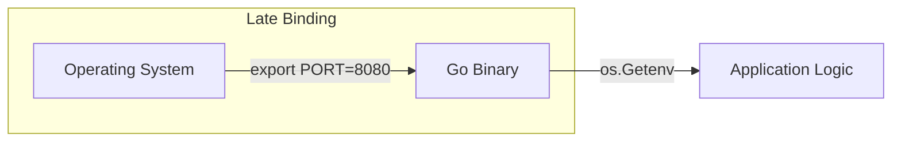

# CFG.1 Environment Variables

## Mission

Master the fundamental tool of cloud-native configuration. Learn how to use environment variables to inject settings into your Go applications without rebuilding the binary. Understand how to use the `os` package to fetch values and how to handle missing or malformed inputs to ensure a stable startup.

## Prerequisites

- None.

## Mental Model

Think of Environment Variables as **The Labels on a Control Panel**.

1. **The Machine (The Binary)**: The machine is identical for every customer. It has buttons and dials but no values pre-set.
2. **The Control Panel (The Environment)**: When you install the machine in a specific factory (Staging or Production), you set the dials to specific values (e.g., `PORT=8080`, `DB_URL=...`).
3. **The Result**: The machine reads the dials when it starts up and knows exactly how to behave in that specific factory.

## Visual Model



## Machine View

- **`os.Getenv(key)`**: Returns the value of the environment variable. If the variable isn't present, it returns an empty string.
- **`os.LookupEnv(key)`**: Returns the value AND a boolean indicating if the variable was actually set. This is critical for distinguishing between an empty value and a missing value.
- **Inheritance**: A child process (your Go app) inherits the environment variables of its parent (the shell or orchestrator).

## Run Instructions

```bash
# Run with a custom environment variable
# Windows (PowerShell):
# $env:APP_PORT=9000; go run ./10-production/04-configuration/1-environment-variables
# Linux/macOS:
# APP_PORT=9000 go run ./10-production/04-configuration/1-environment-variables
```

## Code Walkthrough

### Fetching Values
Shows the basic usage of `os.Getenv` for simple string values.

### Handling Defaults
Demonstrates the pattern of checking if a value is empty and assigning a safe default if it is.

### Lookup vs Getenv
Shows when to use `LookupEnv` to verify that a required configuration was explicitly provided by the user.

## Try It

1. Run the code. Observe the default values.
2. Set a new environment variable `DB_TIMEOUT=30s` and update the code to read it.
3. Discuss: Why are environment variables preferred over hardcoded strings for database passwords?

## In Production
**Document your variables.** Every environment variable your application uses should be listed in a `README.md` or an `.env.example` file. Use **Fail-Fast** logic: if a critical variable like `DATABASE_URL` is missing, the application should call `log.Fatal` immediately on startup. Never assume a "default" for a production database.

## Thinking Questions
1. What is the difference between `os.Getenv` and `os.LookupEnv`?
2. Why are environment variables better than command-line flags for secrets?
3. How do you handle environment variables that contain structured data (like a list of IDs)?

## Next Step

Next: `CFG.2` -> `10-production/04-configuration/2-configuration-files`

Open `10-production/04-configuration/2-configuration-files/README.md` to continue.
