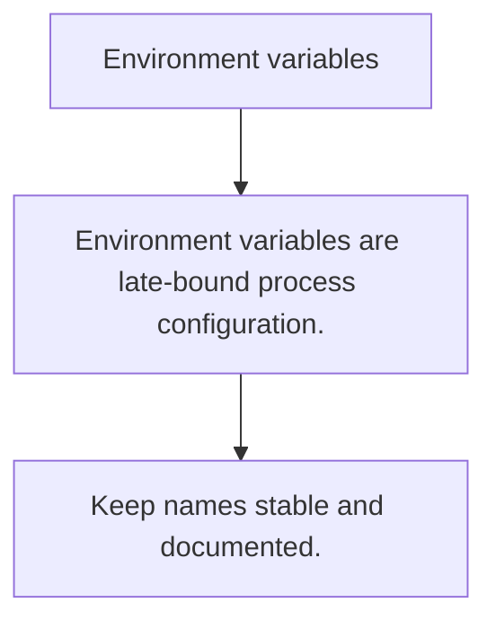

# CFG.1 Environment variables

## Mission

Learn how environment variables shape runtime configuration without rebuilding the binary.

## Prerequisites

- none

## Mental Model

Environment variables are process-level inputs provided by the runtime environment, not by the source code itself.

## Visual Model



## Machine View

The process inherits environment data from the launcher, which makes config injection flexible but also easy to misuse silently.

## Run Instructions

```bash
go run ./10-production/04-configuration/1-environment-variables
```

## Code Walkthrough

### Environment variables are late-bound process configura

Environment variables are late-bound process configuration.

### Missing or malformed values should fail fast.

Missing or malformed values should fail fast.

### Keep names stable and documented.

Keep names stable and documented.

## Try It

1. Change one of the example inputs and rerun the lesson.
2. Explain which boundary the lesson is trying to make explicit.
3. Describe how you would apply CFG.1 in a small service or tool.

## ⚠️ In Production

Environment variables are simple and ubiquitous, but they need documentation and validation to stay reliable.

## 🤔 Thinking Questions

1. What problem does this topic solve?
2. What breaks if this boundary is handled implicitly instead of explicitly?
3. Where would you expect to use this topic in production Go code?

## Next Step

Continue to `CFG.2`.
