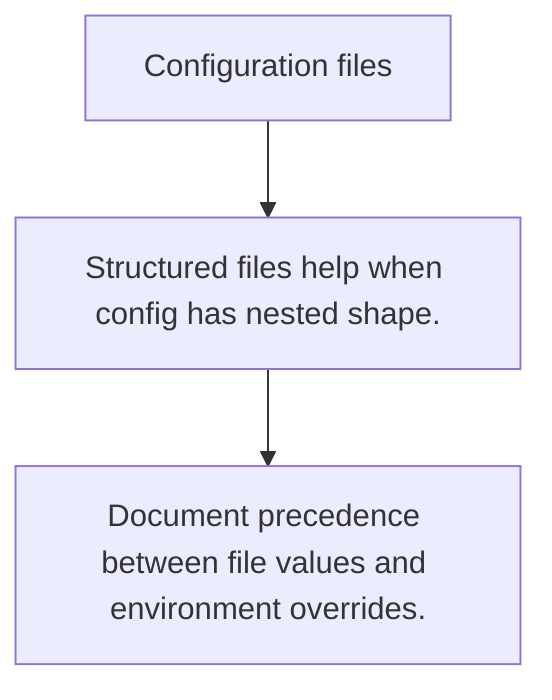

# CFG.2 Configuration files

## Mission

Learn how file-based config complements environment variables when the shape grows beyond a handful of keys.

## Prerequisites

- CFG.1

## Mental Model

Config files trade simple key/value injection for richer structured data.

## Visual Model



## Machine View

The application still needs one parsing and validation boundary before the config can be trusted.

## Run Instructions

```bash
go run ./10-production/04-configuration/2-configuration-files
```

## Code Walkthrough

### Structured files help when config has nested shape.

Structured files help when config has nested shape.

### Parsing is not validation; do both.

Parsing is not validation; do both.

### Document precedence between file values and environmen

Document precedence between file values and environment overrides.

## Try It

1. Change one of the example inputs and rerun the lesson.
2. Explain which boundary the lesson is trying to make explicit.
3. Describe how you would apply CFG.2 in a small service or tool.

## ⚠️ In Production

Config files become liabilities when the precedence rules are unclear or when production secrets sneak into checked-in defaults.

## 🤔 Thinking Questions

1. What problem does this topic solve?
2. What breaks if this boundary is handled implicitly instead of explicitly?
3. Where would you expect to use this topic in production Go code?

## Next Step

Continue to `CFG.3`.
