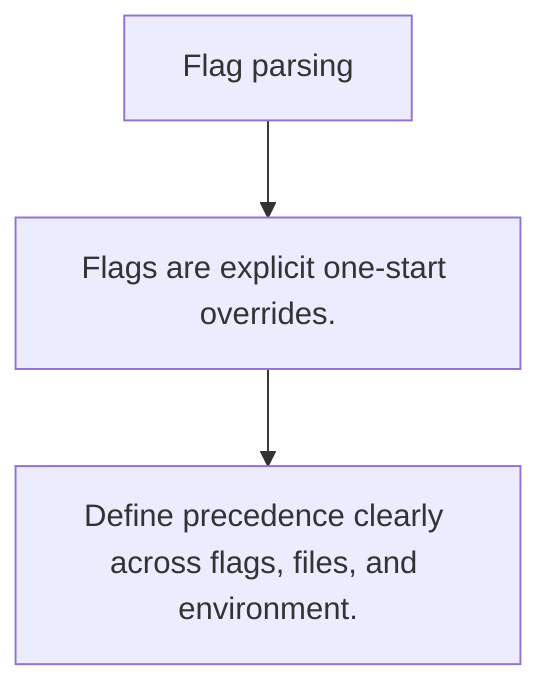

# CFG.3 Flag parsing

## Mission

Learn when startup flags are the right config surface and how they interact with file and env-based config.

## Prerequisites

- CFG.2

## Mental Model

Flags are runtime arguments for one process start, which makes them great for overrides and local tooling.

## Visual Model



## Machine View

The process receives flags before any meaningful application work starts, so they are ideal for startup policy and explicit one-off overrides.

## Run Instructions

```bash
go run ./10-production/04-configuration/3-flag-parsing
```

## Code Walkthrough

### Flags are explicit one-start overrides.

Flags are explicit one-start overrides.

### Do not hide critical startup behavior behind undocumen

Do not hide critical startup behavior behind undocumented flags.

### Define precedence clearly across flags, files, and env

Define precedence clearly across flags, files, and environment.

## Try It

1. Change one of the example inputs and rerun the lesson.
2. Explain which boundary the lesson is trying to make explicit.
3. Describe how you would apply CFG.3 in a small service or tool.

## ⚠️ In Production

Flags are best when the operator should see and choose the value at launch time instead of through ambient environment state.

## 🤔 Thinking Questions

1. What problem does this topic solve?
2. What breaks if this boundary is handled implicitly instead of explicitly?
3. Where would you expect to use this topic in production Go code?

## Next Step

Continue to `CFG.4`.
