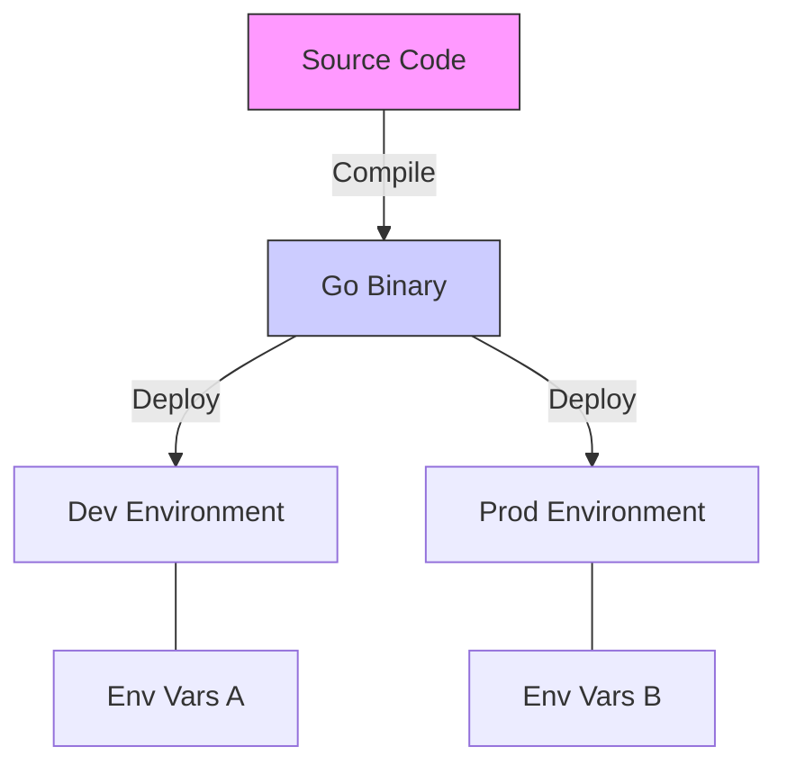

# CFG.4 12-Factor App Principles

## Mission

Master the industry standard for cloud-native applications. Learn the **12-Factor App** principles specifically for Go development. Understand why configuration must be kept strictly separate from code, why logs should be treated as event streams, and how to treat backing services (Databases, Redis) as attached resources.

## Prerequisites

- CFG.1 Environment Variables
- CFG.3 Flag Parsing

## Mental Model

Think of the 12-Factor App as **A Universal Power Adapter**.

1. **The Code (The Device)**: Your Go binary is the device. It has a standard plug.
2. **The Environment (The Socket)**: Every country (Dev, Staging, Prod) has a different socket.
3. **The Adapter (The 12-Factor Config)**: By storing config in the environment, your application can "Plug in" to any environment without modification. If you hardcode the voltage (The Config) into the device, it will blow up when you travel to a different country.

## Visual Model



## Machine View

- **Code/Config Separation**: The core rule. If you can't open-source your application *right now* without leaking a secret, you are violating this principle.
- **Backing Services**: Treat a local MySQL and a managed AWS RDS as the same thing: a URL in an environment variable.
- **Logs as Streams**: A Go app should never manage its own log files (rotation, compression). It should simply write to `Stdout`, and let the execution environment (Docker/K8s) handle the rest (Track SL).

## Run Instructions

```bash
# Run the demo to see 12-Factor principles in code
go run ./10-production/04-configuration/4-twelve-factor-principles
```

## Code Walkthrough

### Environment-Based Config
Demonstrates the use of `os.Getenv` as the primary configuration mechanism.

### Service Attachment
Shows how to represent a "Backing Service" as a simple connection string injected at runtime.

### The Immutable Build
Discusses why the binary should never be modified once it is compiled (Build -> Release -> Run).

## Try It

1. Look at `main.go`. Identify any hardcoded strings that violate the 12-Factor principles.
2. Move those hardcoded strings into environment variables.
3. Discuss: Why does the 12-Factor app suggest using environment variables instead of config files? (Hint: Portability and standard OS support).

## In Production
**Don't be a zealot.** The 12-Factor principles were written in 2011. While the core idea (Config in Env) is still valid, modern practices sometimes favor **Config Maps** (Files) in Kubernetes for complex structures. The spirit is what matters: **Portability and Separation**. If your app is hard to deploy because it requires a "Magic File" in a specific folder, you are doing it wrong.

## Thinking Questions
1. Why is "Store config in the environment" the most famous of the 12 factors?
2. What does it mean to treat a database as an "Attached Resource"?
3. How does the "Build, Release, Run" principle improve deployment safety?

## Next Step

Config is only useful if it's correct. Learn how to validate your application settings before the first user request arrives. Continue to [CFG.5 Validation on Boot](../5-config-validation-on-boot).
