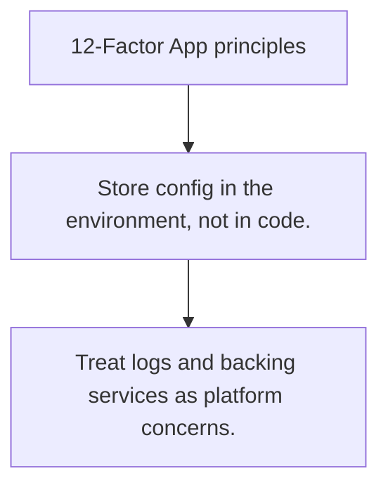

# CFG.4 12-Factor App principles

## Mission

Learn the configuration and deployment discipline behind the 12-Factor mindset.

## Prerequisites

- CFG.3

## Mental Model

12-Factor is a set of operational habits that keep apps portable and environment-aware.

## Visual Model



## Machine View

The principles matter because production reliability depends on how the app is packaged, configured, and operated, not just on the correctness of the business code.

## Run Instructions

```bash
go run ./10-production/04-configuration/4-twelve-factor-principles
```

## Code Walkthrough

### Store config in the environment, not in code.

Store config in the environment, not in code.

### Keep build, release, and run concerns separate.

Keep build, release, and run concerns separate.

### Treat logs and backing services as platform concerns.

Treat logs and backing services as platform concerns.

## Try It

1. Change one of the example inputs and rerun the lesson.
2. Explain which boundary the lesson is trying to make explicit.
3. Describe how you would apply CFG.4 in a small service or tool.

## ⚠️ In Production

The most useful part of 12-Factor for Go teams is the config and deployment discipline, not ritual compliance with every slogan.

## 🤔 Thinking Questions

1. What problem does this topic solve?
2. What breaks if this boundary is handled implicitly instead of explicitly?
3. Where would you expect to use this topic in production Go code?

## Next Step

Continue to `CFG.5`.
