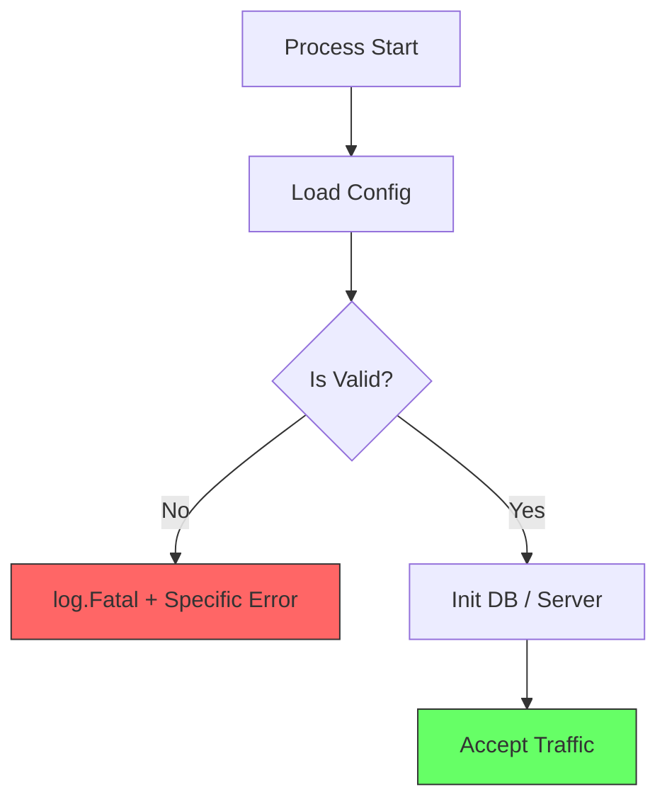

# CFG.5 Validation on Boot

## Mission

Master the "Fail-Fast" principle. Learn how to validate your application's configuration **immediately** upon startup, before any database connections are opened or any HTTP listeners are started. Understand how to use Go's typing and custom validation logic to ensure that your application only runs when it has everything it needs to succeed.

## Prerequisites

- CFG.1 - CFG.4 (Mastery of the configuration sources)
- SEC.1 Input Validation Patterns (Applying the same logic to config)

## Mental Model

Think of Validation on Boot as **A Pre-Flight Checklist**.

1. **The Goal**: A pilot doesn't wait until they are at 30,000 feet to find out they are out of fuel.
2. **The Checklist**: Before the engines start, the pilot checks the fuel, the flaps, and the instruments.
3. **The Fail-Fast**: If any check fails, the plane stays on the ground (The application exits with an error).
4. **The Result**: You prevent "Ghost Failures" where an application starts up fine but crashes 10 minutes later because a specific setting was missing.

## Visual Model



## Machine View

- **Implicit vs. Explicit**: Go defaults variables to zero values (0, ""). If you don't validate, your app might try to connect to a database at host `""` or port `0`.
- **`log.Fatal`**: The standard way to exit during boot. it prints the error and calls `os.Exit(1)`.
- **Custom Validation**: A common pattern is to add a `.Validate() error` method to your configuration struct.

## Run Instructions

```bash
# Run with valid config
# $env:APP_PORT=8080; go run ./10-production/04-configuration/5-config-validation-on-boot

# Run with INVALID config to see the fail-fast behavior
# $env:APP_PORT=-1; go run ./10-production/04-configuration/5-config-validation-on-boot
```

## Code Walkthrough

### The Config Validator
Shows how to implement a `Validate()` method that checks for mandatory fields, valid port ranges, and properly formatted URLs.

### The Startup Sequence
Demonstrates the exact line of code where validation happens: after the config is loaded but *before* the first resource is initialized.

### Specific Error Messages
Shows why you should return "Missing DATABASE_URL" instead of a generic "Invalid config."

## Try It

1. Run the code with a valid port.
2. Try running it without setting any environment variables. Observe the error message.
3. Add a new required configuration `API_KEY` and update the validation logic to ensure it is at least 32 characters long.
4. Discuss: Why is it better to fail on boot than to use a "fallback" for a critical production setting?

## In Production
**Don't rely on your cloud provider's UI.** Just because you "set" the variable in the AWS or Heroku console doesn't mean your app is receiving it correctly. Validation on boot is your **Final Defense**. It protects you from typos in variable names (e.g., `DATABSE_URL` instead of `DATABASE_URL`) and ensures that your deployment pipeline is actually working as intended.

## Thinking Questions
1. Why is "Fail-Fast" considered a best practice for production operations?
2. What is the danger of providing "Safe Defaults" for production environments?
3. How can you automate the testing of your configuration validation logic?

## Next Step

Next: `OPS.1` -> `10-production/05-observability/1-metrics-basics`

Open `10-production/05-observability/1-metrics-basics/README.md` to continue.
