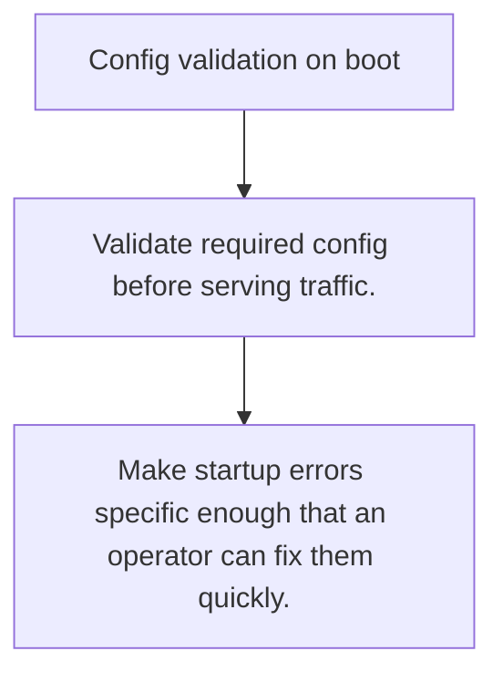

# CFG.5 Config validation on boot

## Mission

Learn why services should reject invalid configuration before they begin handling traffic.

## Prerequisites

- CFG.4

## Mental Model

Bad config is a startup failure, not a runtime surprise to discover under real traffic.

## Visual Model



## Machine View

Boot-time validation turns hidden misconfiguration into one deterministic failure close to process start.

## Run Instructions

```bash
go run ./10-production/04-configuration/5-config-validation-on-boot
```

## Code Walkthrough

### Validate required config before serving traffic.

Validate required config before serving traffic.

### Collect configuration into one typed structure before 

Collect configuration into one typed structure before deeper initialization.

### Make startup errors specific enough that an operator c

Make startup errors specific enough that an operator can fix them quickly.

## Try It

1. Change one of the example inputs and rerun the lesson.
2. Explain which boundary the lesson is trying to make explicit.
3. Describe how you would apply CFG.5 in a small service or tool.

## ⚠️ In Production

Fail-fast startup is kinder to operators because the error appears when the service launches, not minutes later under production load.

## 🤔 Thinking Questions

1. What problem does this topic solve?
2. What breaks if this boundary is handled implicitly instead of explicitly?
3. Where would you expect to use this topic in production Go code?

## Next Step

Use this lesson as a reference surface before moving to the next track in the section.
