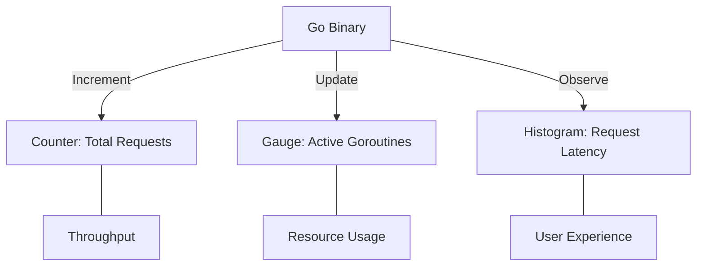

# OPS.1 Metrics Basics

## Mission

Master the fundamental types of observability data. Learn the difference between **Counters**, **Gauges**, and **Histograms**. Understand why metrics are better than logs for answering questions about "How many" and "How fast," and learn the importance of **Cardinality** discipline in production monitoring.

## Prerequisites

- None.

## Mental Model

Think of Metrics as **The Dashboard of a Car**.

1. **The Odometer (Counter)**: A value that only goes up (Total distance traveled). You use it to calculate "Miles per hour" (Throughput).
2. **The Gas Gauge (Gauge)**: A value that goes up and down (Fuel level, CPU usage). It tells you the state *right now*.
3. **The Speedometer Distribution (Histogram)**: It doesn't just tell you your current speed; it tells you how much of your trip was spent at 60 MPH vs 20 MPH (Latencies).

## Visual Model



## Machine View

- **Counters**: A simple atomic integer. They are extremely cheap to increment.
- **Gauges**: A float or integer that represents a current state.
- **Histograms**: These are the most expensive because they must maintain multiple "Buckets" of data to track the distribution of values over time.
- **Cardinality**: The number of unique combinations of labels. If you add a `user_id` label to a metric, and you have 1 million users, you just created 1 million unique metrics, which will likely crash your monitoring system.

## Run Instructions

```bash
# Run the demo to see how different metric types behave
go run ./10-production/05-observability/1-metrics-basics
```

## Code Walkthrough

### The Counter Pattern
Shows how to track the total number of HTTP requests processed by a service.

### The Gauge Pattern
Demonstrates tracking a fluctuating value like the number of items in a processing queue.

### The Histogram Pattern
Shows how to record the duration of a function call and see the distribution of "Fast" vs "Slow" calls.

## Try It

1. Run the code. Observe how the Counter always increases while the Gauge fluctuates.
2. Add a new Counter `errors_total` and increment it only when a simulated error occurs.
3. Discuss: Why is it a bad idea to use a Histogram for every single function call in your application?

## In Production
**Labels are for Dimensions, not for Data.** Use labels like `method="GET"` or `status="200"`. **Never** use labels like `request_id`, `user_email`, or `search_query`. These high-cardinality labels will explode your storage costs and make your dashboards unreadably slow.

## Thinking Questions
1. When should you use a Gauge instead of a Counter?
2. What is the "P99" latency, and why is it more important than the "Average"?
3. How do metrics help you set Service Level Objectives (SLOs)?

## Next Step

Next: `OPS.2` -> `10-production/05-observability/2-prometheus-integration`

Open `10-production/05-observability/2-prometheus-integration/README.md` to continue.
