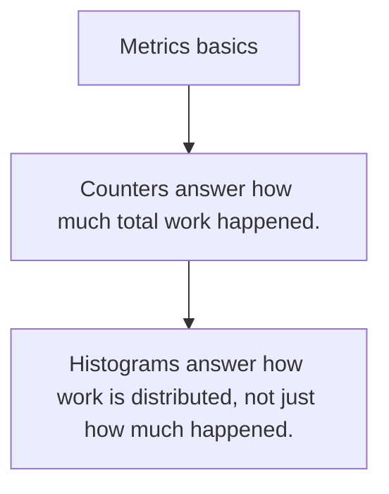

# OPS.1 Metrics basics

## Mission

Learn what metrics answer that logs do not and why cardinality discipline matters early.

## Prerequisites

- none

## Mental Model

Metrics are numeric summaries over time, which makes them good for trend and saturation questions.

## Visual Model



## Machine View

Counters, gauges, and histograms are cheap ways to turn runtime behavior into something dashboards and alerts can reason about.

## Run Instructions

```bash
go run ./10-production/05-observability/1-metrics-basics
```

## Code Walkthrough

### Counters answer how much total work happened.

Counters answer how much total work happened.

### Gauges answer what value is true right now.

Gauges answer what value is true right now.

### Histograms answer how work is distributed, not just ho

Histograms answer how work is distributed, not just how much happened.

## Try It

1. Change one of the example inputs and rerun the lesson.
2. Explain which boundary the lesson is trying to make explicit.
3. Describe how you would apply OPS.1 in a small service or tool.

## ⚠️ In Production

Observability starts with choosing stable dimensions. Cardinality explosions make a correct metrics program operationally useless.

## 🤔 Thinking Questions

1. What problem does this topic solve?
2. What breaks if this boundary is handled implicitly instead of explicitly?
3. Where would you expect to use this topic in production Go code?

## Next Step

Continue to `OPS.2`.
