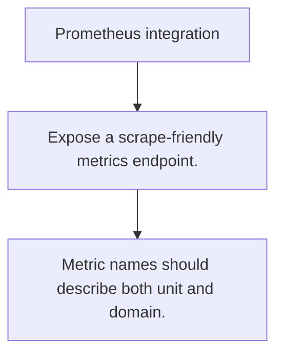

# OPS.2 Prometheus integration

## Mission

Learn the scrape-based model behind Prometheus and how application metrics become time series.

## Prerequisites

- OPS.1

## Mental Model

Prometheus pulls metrics from your service on a regular interval instead of waiting for the service to push them.

## Visual Model



## Machine View

Metric names, labels, and buckets become the long-term contract your dashboards and alerts depend on.

## Run Instructions

```bash
go run ./10-production/05-observability/2-prometheus-integration
```

## Code Walkthrough

### Expose a scrape-friendly metrics endpoint.

Expose a scrape-friendly metrics endpoint.

### Choose labels that stay bounded over time.

Choose labels that stay bounded over time.

### Metric names should describe both unit and domain.

Metric names should describe both unit and domain.

## Try It

1. Change one of the example inputs and rerun the lesson.
2. Explain which boundary the lesson is trying to make explicit.
3. Describe how you would apply OPS.2 in a small service or tool.

## ⚠️ In Production

Prometheus is simple to adopt, but label discipline and bucket design matter far more than whether the scrape endpoint exists.

## 🤔 Thinking Questions

1. What problem does this topic solve?
2. What breaks if this boundary is handled implicitly instead of explicitly?
3. Where would you expect to use this topic in production Go code?

## Next Step

Continue to `OPS.3`.
